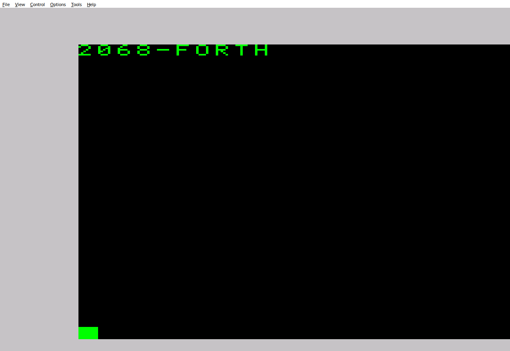

# EightyOne setup

Ported from the sibling `ts2068rom` project's own `docs/eightyone_setup.md`.
The convention here — Home ROM via **ROM File**, EXROM wrapped as a
`.dck` **ROM Cartridge** alongside it, with the specific 9-byte header
shape below — came directly from EightyOne's own developer, not a
guess or a third-party reverse-engineering effort, and was confirmed
working on Windows, released version 1.41. The header bytes are reused
unchanged from that guidance, not re-derived.

TS-Pico is NOT covered here — its ROM/cartridge loading mechanism turns
out to be different enough (no EXROM slot at all, a completely separate
Home-ROM-replacement path from its DOCK-cartridge path) that it has its
own dedicated doc: [`ts_pico_setup.md`](ts_pico_setup.md).

## Running on Linux via Wine

This project's own EightyOne install runs under Wine on Linux
(`~/81.sh` launches it: `cd ~/EightyOne && wine EightyOne.exe`).
**Confirmed working in this project's own environment**: booting
`build/forth_boot_rom0.bin` as the Home ROM with the placeholder EXROM
cartridge produces the real `2068-FORTH` startup banner, captured by screenshot:



EightyOne stores its configuration in a plain INI file at
`~/.wine/drive_c/users/<user>/AppData/Roaming/EightyOne/EightyOne.ini`
under `[HARDWARE]` (`ROMTS2068=`, `RomFile=`, `RomCartridgeFile=`,
etc.) — editing it directly and relaunching `wine EightyOne.exe` is a
faster way to swap ROM images than clicking through the dialogs below
each time, and is how the confirmation above was actually done.

**The graphics EXROM cartridge (`RECT`/`POLYGON`/`POLYGON-FILL`/
sprites) does not load correctly through EightyOne 1.41's DCK
mechanism — and this is now a confirmed EightyOne-specific problem,
not an unverified guess or a headless-sandbox artifact.** All eight
possible chunk-flag byte positions in the 9-byte header were tried
against `rom/test_rect.asm` + `build/graphics_exrom.bin` under
Wine/EightyOne 1.41, and none produced a passing (green) border — the
project's own author independently confirmed the same failure on a
real interactive Windows install, ruling out the headless-Wine theory.

What rules out the `.dck` file itself being wrong: the exact same
`build/graphics_exrom_eightyone.dck` — byte-for-byte, no changes —
passes under two other, independent implementations of the same DCK
format:

- **[TSRun](https://josef-jelinek.github.io/TSRun/)** (open source,
  `github.com/josef-jelinek/TSRun`): running its actual, unmodified
  `dock.js`/`machine.js`/`z80.js` headlessly under Node against
  `test_rect_rom0.bin` + this exact `.dck` produces a GREEN border
  (full pass) after boot. A negative control — the same Home ROM with
  the content-free placeholder `.dck` instead — correctly produces
  BLUE (checkpoint 1 fail), confirming the harness discriminates
  correctly rather than always reporting green.
- **ZEsarUX and Fuse** both run the identical Home ROM + EXROM image
  pair to GREEN too (via their own non-DCK loading mechanisms — see
  the main README's "Running it" section).
- TS-Pico's own firmware source (`tspico.py`) parses the identical
  9-byte header shape the same way (bank `$FE` = EXROM, direct
  chunk-index correspondence) — see `docs/ts_pico_setup.md`.

Three independent implementations agree on what this `.dck` file means
and all execute it correctly. That points at something specific to
EightyOne 1.41's own DCK handling — worth reporting to EightyOne's
developer directly, with this exact file and the TSRun cross-check as
evidence, rather than continuing to guess at header byte positions.

## Build the emulator images

```sh
make forth-boot
tools/make_exrom_placeholder.sh
tools/make_eightyone_exrom_dck.sh build/stock_shaped_exrom.bin build/forth_exrom_eightyone.dck
```

This produces two files for EightyOne and TS-Pico:

- `build/forth_boot_rom0.bin` — the 16K Home ROM image.
- `build/forth_exrom_eightyone.dck` — the 8K EXROM placeholder packaged
  as an EightyOne/TS-Pico Timex cartridge. Since nothing in the base
  product ROM ever pages EXROM in (only the Phase 65 graphics words do
  — see below), this placeholder cartridge is enough to boot and use
  every word EXCEPT `RECT`/`POLYGON`/`POLYGON-FILL`/`SPRITE-DEFINE`/
  `SPRITE-SHOW`/`SPRITE-HIDE`.

EightyOne v1.41 does not load a raw EXROM binary as a cartridge. Its
`.dck` file is the raw EXROM preceded by these nine bytes:

```text
FE 00 00 00 00 00 02 00 00
```

(bank id `$FE` = EXROM bank, followed by one presence-flag byte per
chunk 0-7 in order; chunk 5 — the same `$A000-$BFFF` chunk
`kernel/bank/bank.asm` pages the real EXROM into as of this project's
own Phase 65 — marked `$02`, ROM present, every other chunk `$00`.)
`tools/make_eightyone_exrom_dck.sh` builds this deterministically and
verifies the input is exactly 8192 bytes and the output exactly 8201.
This byte position was originally ported from the sibling `ts2068rom`
project's own chunk-6 EXROM (`$02` one byte later, at index 7) and only
updated to chunk 5 once `kernel/bank/bank.asm` was itself retargeted
there — see that script's own header for the full position-math
reasoning, and "Summary of confirmed status" below.

## Using the real graphics EXROM (RECT/POLYGON/POLYGON-FILL/sprites)

`RECT`, `POLYGON`, `POLYGON-FILL`, and `SPRITE-DEFINE`/`SPRITE-SHOW`/
`SPRITE-HIDE` (Phase 65) are dispatched through a second, real 8K EXROM
image, `build/graphics_exrom.bin` — the placeholder above has no real
code in it, so these six words will each silently do nothing against it
(the same magic/ABI mismatch guard every other word in this project
already uses instead of crashing). Build and package the real image
instead:

```sh
make forth-boot graphics-exrom
tools/make_eightyone_exrom_dck.sh build/graphics_exrom.bin build/graphics_exrom_eightyone.dck
```

Use `build/graphics_exrom_eightyone.dck` as the **ROM Cartridge** file
in step 4 below instead of `build/forth_exrom_eightyone.dck` — the two
are not interchangeable, and only one cartridge can be loaded at a time,
so a session using the placeholder cartridge won't have RECT/POLYGON/
POLYGON-FILL/sprites available, and vice versa.

## Configure EightyOne 1.41

1. Select the **Timex** tab and the **TS2068** machine.
2. Under **Advanced Settings**, set **ROM File** to `build/forth_boot_rom0.bin`.
3. Leave **Protect ROM from Writes** enabled.
4. Under **Interfaces**, set **ROM Cartridge** to **Timex** and select
   `build/forth_exrom_eightyone.dck` (or `build/graphics_exrom_
   eightyone.dck` — see above) as the cartridge file.
5. Apply the settings and perform a hard reset.

Do not select a raw `.bin` EXROM file in the ROM Cartridge field; use
the `.dck` file.

## TS-Pico is different — see its own doc

An earlier version of this doc claimed the same `.dck` files here were
also the correct images for TS-Pico. Research into TS-Pico's own
firmware source (not available when this doc was first written) shows
that's wrong in an important way: TS-Pico has no EXROM slot at all,
only a Home-ROM slot and a separate DOCK-cartridge slot, and the two
are loaded through entirely different commands. See
[`ts_pico_setup.md`](ts_pico_setup.md) for the corrected, sourced
picture — including what already works on TS-Pico today (the full
non-graphics product, via its Home-ROM slot) and what doesn't yet
(the graphics extension, which has no path to TS-Pico's EXROM at all
since TS-Pico doesn't have one).

## Summary of confirmed status

- **Home ROM boot (`forth_boot_rom0.bin` + placeholder `.dck`)** —
  confirmed, both under Wine on Linux (this project) and on Windows
  (project author).
- **Graphics cartridge (`graphics_exrom_eightyone.dck`, chunk 5)** —
  confirmed NOT working on real EightyOne 1.41 (Wine and Windows both),
  while the identical file is confirmed correct by two other DCK
  consumers (TSRun, ZEsarUX/Fuse via non-DCK loading) — see "Using the
  real graphics EXROM" above for the full cross-check. This is now
  understood as an EightyOne-specific issue worth reporting upstream,
  not an open question about this project's own header byte position.

This is unrelated to `docs/lros_cartridge.md`'s DOCK/LROS cartridge work:
that targets bank id `$0` (DOCK) with chunk 0 populated, a different
cartridge slot and convention from the EXROM (`$FE`) packaging here.
