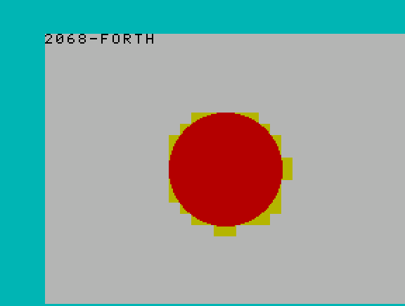
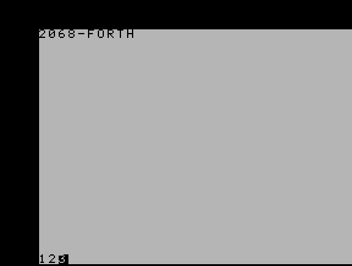
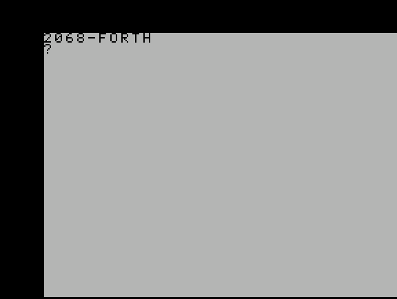

# Learning Forth on 2068-Forth

This document teaches Forth from scratch. It assumes you're comfortable
with BASIC — line numbers, `LET`/`PRINT`/`IF`, variables — but *not*
with Forth.

The sections run in the order you'd want to *learn* the language — the
stack first, then defining your own words, then control flow, data,
and finally the screen and keyboard. Examples are provided that you can type at a
real 2068-Forth prompt.

And the prompt really is live: turn the machine on and you get a
banner, a short startup sound, and a keyboard-driven prompt waiting for
you.

### How to read the examples

Two small conventions, so nothing later surprises you.

Anything after a `\` in an example is a note **from this document to
you**, explaining what just happened. It is not part of the Forth.
2068-Forth has no comment word at all — not `\`, not the `(` that
larger Forths use — so if you type one of those notes in, the
interpreter will try to look up `\` as a word, fail to find it, and
complain. Type only what comes before the `\`.

And each section genuinely builds on the one before it. Where a later
section leans on something earlier, it says so and reminds you of the
part that matters, so you shouldn't need to keep flipping back — but
the sections are in learning order for a reason, and reading them out
of order will cost you more than it saves.


---

## 1. What Forth actually is

In BASIC, every line is a *statement*: `LET X = 5+3`, `PRINT X`,
`IF X > 3 THEN GOTO 100`. The language has grammar. `LET` needs its
`=`; `IF` needs its `THEN`.

Forth has no grammar at all. A Forth program is a sequence of **words**
separated by spaces, and the whole language runs on a single rule:
*read the next word, then either run it or compile it.* That rule,
repeated, is everything.

### Words and the dictionary

Everything in Forth — `+`, `DUP`, a word you wrote yourself — lives in
the **dictionary**, the complete list of every word the system
currently knows. Type a word and Forth looks it up there by name. If
the lookup fails, Forth tries to read it as a plain number instead. If
*that* fails, you've hit a typo or an undefined word, and Forth prints
`?` on its own line and returns you to a fresh prompt rather than
doing nothing visible or crashing (see
[Typing and editing at the prompt](#13-typing-and-editing-at-the-prompt)
for more).

The dictionary is searched **newest-first**. Define a word with the
same name as an existing one and your version takes over for anything
you type *after* that point; the old one still exists deeper in the
dictionary, so anything that already used it keeps working unchanged
— it's simply no longer what a plain lookup finds by that name. That's
occasionally useful (redefining a word to fix a mistake without
restarting) and occasionally confusing (forgetting you shadowed
something), which makes it worth knowing either way.

That single idea — read a word, look it up, run whatever it names —
is the whole of "read the next word" from above. The next question is
what running a word actually *does*, and that's where the stack comes
in.

### The stack, and why `5 3 +` means "5 + 3"

BASIC writes arithmetic *infix* — the operator sits between its
operands, `5 + 3`. Forth writes it **postfix**: operands first,
operator last, `5 3 +`. That isn't a stylistic quirk. It's precisely
what lets "read a word, run it" work with no grammar to lean on.

The mechanism is a **stack**: a pile of numbers, where you can only
ever see or remove the top one. The picture worth holding in your head
is a pile of index cards. To remember a number, the machine writes it
on a fresh card and drops that card on top of the pile. To *use* a
number, it takes the top card off, reads it, and throws it away.

Every word does one of two things to that pile.

- A **number** gets *pushed*: a new card on top.
- An **operator** *pops* however many cards it needs off the top,
  computes something, and pushes one card back with the answer on it.

Which gives Forth's whole working rule, and it's the same rule a recipe
uses: **first gather the ingredients, then say what to do with them.**
The numbers go on the stack first; the word that acts on them comes
last.

Trace `5 3 +` one word at a time:

```
you type   stack after (top is rightmost)
--------   ----------------------------
5          [5]           -- push 5
3          [5, 3]        -- push 3
+          [8]           -- pop 3 and 5, push their sum
```

No parentheses, no operator precedence, no parsing whatsoever — the
stack *is* the grammar. `+` never needs to know whether `5` and `3`
came from literals, from variables, or from other words; it takes the
top two numbers, whatever put them there.

### Seeing the answer: `.`

That `8` is sitting on the stack, and the stack is invisible. Nothing
appears on screen unless you ask, so before going further you need one
more word — `.`, pronounced "dot". `.` takes the top number off the
stack and prints it.

```forth
5 3 + .        \ prints 8
```

`.` is a word like any other. It follows the same "ingredients first"
rule: it wants a number already sitting on the stack, and it takes it
away when it prints it. That last part matters and catches people out
— after `5 3 + .` the stack is empty again, because printing consumed
the `8`. (There's more to say about `.` and its relatives, but it waits
until [Printing](#8-printing), by which point you'll have used it
dozens of times.)

### A longer trace

One three-word example is thin evidence. Here's a slightly bigger one,
adding three numbers together, traced the same way. Notice that the
intermediate answer never needs printing or storing anywhere — it just
stays on the stack, ready for the next `+`:

```forth
10 11 + 12 + .        \ prints 33
```

```
you type   stack after
--------   -----------
10         [10]         -- push 10
11         [10, 11]     -- push 11
+          [21]         -- pop both, push 21
12         [21, 12]     -- push 12
+          [33]         -- pop both, push 33
.          []           -- pop 33, print it
```

One way of looking at that: `11 +` means "add 11 to whatever's on
top", `12 +` means "add 12 to whatever's on top", and the `10` at the
front is simply what starts the pile off. Read that way, a Forth line
is a series of small adjustments to the top of the stack, applied left
to right.

This is also why Forth reads differently. A BASIC expression like
`(5+3)-2` nests outward from its innermost operation, while the Forth
equivalent, `5 3 + 2 -`, reads left to right in the exact order the
machine does the work: push 5, push 3, add, push 2, subtract. Once that
clicks, you stop translating BASIC expressions in your head and start
thinking in the order operations actually happen.

### Order matters — even when you'd swear it didn't

`+` doesn't care which of its two numbers came first; `5 3 +` and
`3 5 +` both give 8. `-` very much does. It subtracts the **top** of
the stack from the one **underneath** it:

```forth
10 3 - .      \ prints 7
3 10 - .      \ prints -7
```

You might expect the second one to be an error, or to quietly give 7
as well. It isn't and it doesn't — it's a perfectly valid subtraction
that happens to run the other way round, and Forth has no way to know
you meant the first. Read `10 3 -` out loud as "ten, three, subtract",
in the same order you'd write it on paper as `10 - 3`, and the pattern
sticks: the operands stay in the order you'd say them, only the
operator moves to the end.

Before moving on, a small thing worth doing at the keyboard rather
than in your head: type `5 3 + .` and then, on the next line, type just
`.` again. There's nothing left on the stack for it to print, so `.`
prints whatever nonsense number happens to be sitting just past the
bottom of the stack — and *then* Forth notices what you did and answers
`STACK?`. The check happens once the word has finished, not before it
starts, which is why you see the nonsense number at all. It's not a
crash, and it doesn't lose any words you've defined; it just empties
the stack and hands you a fresh prompt. Seeing that once now,
deliberately, is much nicer than meeting it by accident later.
([Typing and editing at the
prompt](#13-typing-and-editing-at-the-prompt) covers the error messages
properly.)

### Rearranging the stack

With no variable names anywhere, getting a value into the right
position *is* frequently the whole problem. Take something as simple
as doubling a number: `5 5 +` works, but only because `5` was typed
twice by hand. A word that doubles *whatever's already on the stack*
has to make that second copy itself — it can't "read" a value without
also consuming it, and it has no variable to stash a copy in either.

That's exactly what a handful of words exist to do: not compute
anything, just shuffle what's already on the stack so the next word
finds what it needs on top.

| Word | Stack effect | What it does |
|---|---|---|
| `DUP` | `( n -- n n )` | Duplicate the top value |
| `SWAP` | `( a b -- b a )` | Swap the top two values |
| `DROP` | `( n -- )` | Discard the top value |
| `OVER` | `( a b -- a b a )` | Copy the second value to the top |

Doubling, then, is `5 DUP +`. Traced out, exactly as before:

```
you type   stack after
--------   -----------
5          [5]          -- push 5
DUP        [5, 5]       -- copy the top card
+          [10]         -- pop both, push their sum
```

### Reading the `( n -- n n )` shorthand

That notation in the table's middle column is standard Forth shorthand,
and it's worth stopping on for a moment, because it's the vocabulary
the rest of this document (and every Forth manual you'll ever read)
uses to describe what a word does.

Writing out a card-by-card trace every time gets tedious fast. So
instead of a trace, a word gets one line: **the stack just before it
runs, an arrow, then the stack just after**, with the top of the stack
always rightmost in each group. `DUP`'s `( n -- n n )` says: there was
one value on top; afterwards there are two copies of it.

The useful thing about the notation is that it applies just as well to
words you've *already* met. Re-read the last few pages through it:

- A **number** you type is `( -- n )`. It takes nothing and leaves one
  value.
- `+` is `( a b -- a+b )`. Two values in, one out.
- `-` is `( a b -- a-b )` — and now the ordering rule from earlier has
  a compact home: `a` is the deeper one, `b` is on top, and the result
  is `a` minus `b`, not the other way round.
- `.` is `( n -- )`. One value in, *nothing* left. That's the notation
  saying, in three characters, the thing that trips people up: `.`
  consumes what it prints.

Notice that the two sides needn't list the same number of values.
`DROP`'s `( n -- )` takes one and leaves none; `DUP`'s `( n -- n n )`
takes one and leaves two; a bare number's `( -- n )` takes none and
leaves one. A word's number of inputs and its number of outputs are
completely independent, and nothing anywhere requires them to match.
This is a real freedom rather than an accident, and later words lean on
it heavily.

One caution: the letters in a stack effect are just placeholders,
picked to be readable. `( a b -- b a )` and `( n1 n2 -- n2 n1 )` say
exactly the same thing about `SWAP`. Don't read meaning into the
choice of letter — read the *positions*.

Back to the shuffling words themselves. Here's `OVER` and `SWAP`
earning their keep, computing both differences of a subtraction from a
single pair of numbers:

```forth
10 3 OVER OVER SWAP - .    \ prints -7
- .                        \ prints 7
```

That's dense enough to deserve a full trace. The trick is that
`OVER OVER` makes a spare copy of *both* numbers, so the first
subtraction can eat the copies and leave the originals untouched
underneath:

```
you type   stack after
--------   -----------
10         [10]
3          [10, 3]
OVER       [10, 3, 10]        -- copy the second value up
OVER       [10, 3, 10, 3]     -- and again: a full spare pair
SWAP       [10, 3, 3, 10]     -- flip just the spare pair round
-          [10, 3, -7]        -- 3 - 10, using up the spares
.          [10, 3]            -- prints -7; originals still there
-          [7]                -- 10 - 3, using the originals
.          []                 -- prints 7
```

Notice what the `SWAP` is for. Without it, the first `-` would have
computed `10 - 3` and you'd have had no way to get at `3 - 10`
afterward, because the numbers it needed would already be gone. Making
a spare copy *before* consuming anything is the single most common
reason any of these words get used at all.

A few more round out the set, for when three or more values need
rearranging, or when something further down needs reaching without
disturbing what sits above it:

| Word | Stack effect | What it does |
|---|---|---|
| `ROT` | `( a b c -- b c a )` | Rotate the third value to the top |
| `2DUP` | `( a b -- a b a b )` | Duplicate the top *pair* |
| `2DROP` | `( a b -- )` | Discard the top *pair* |
| `?DUP` | `( n -- 0 \| n n )` | Duplicate, but only if `n` isn't zero |
| `PICK` | `( ... n -- ... x )` | Copy the `n`th value from the top (0 = same as `DUP`, 1 = same as `OVER`) |

`?DUP` looks like an odd thing to want, and it's the one word in that
table you can't guess the point of. It exists for a single pattern that
turns out to be extremely common: testing a value while still wanting
to *use* it afterward if the test passed. Making a decision consumes
the value being tested, so without `?DUP` you'd have to make a copy,
test the copy, and then remember to throw the spare away again on the
branch where you didn't need it. `?DUP` copies only when there'll be a
use for the copy, which makes that cleanup unnecessary.

```forth
SOME-WORD ?DUP IF . THEN     \ prints the result, but only if nonzero
```

That won't fully make sense until you've met `IF`, which is
[section 6](#6-making-decisions-if-else-then) — and section 6 comes
back to `?DUP` and shows the same example written both ways, with and
without it, so you can see exactly what it saved. For now just note
that the word exists and that its strange-looking `( n -- 0 | n n )`
stack effect is honest: it really does leave a different number of
values depending on what it found.

`PICK` generalizes `DUP` and `OVER` to reach deeper without a chain of
`ROT`s. `2 PICK` reaches the third value from the top — the same place
`ROT` would bring up — but *copies* it rather than moving it:

```forth
10 20 30  2 PICK .    \ [10, 20, 30, 10] then prints 10, leaving [10, 20, 30]
```

`PICK` does no bounds checking on its own argument. Asking for a value
deeper than the stack actually holds reads whatever memory happens to
sit past it — not a crash, but not meaningful data either. That's the
same "trust the caller" posture most of this project's lower-level
words take; the honest-limits notes throughout this document flag the
others, `BEEP`'s among them (see
[Drawing and sound](#9-drawing-and-sound)).

### Where you are now

That's the entire foundation, and it's worth stating compactly before
building anything on top of it:

1. A Forth program is words separated by spaces, and the rule is *read
   the next word, look it up in the dictionary, run it.*
2. Words pass values to each other through one shared pile — the stack.
   Numbers push; other words pop what they need and push results.
3. Ingredients first, action last: `5 3 +`, not `5 + 3`.
4. Nothing prints unless you ask, and `.` is how you ask.
5. `( before -- after )` is how a word's effect on the stack gets
   written down, top of stack rightmost.

Everything in the rest of this document is those five things applied to
progressively more interesting problems. If any of them still feels
shaky, it's worth a few minutes at the keyboard now rather than later —
push some numbers, print them back, and watch the pile go up and down.

---

## 2. Defining your own words

Here's the part BASIC has no real equivalent for. In BASIC you write a
program, and the language itself doesn't grow while you use it. In
Forth, defining a word **extends the language** — your word becomes as
usable as `+` or `DUP`, no different in kind.

```forth
: DOUBLE  DUP + ;
```

Left to right: `:` says "define a new word named `DOUBLE`, out of
everything up to the next `;`." Each word inside the definition — here
`DUP` and `+` — is remembered as part of what `DOUBLE` does rather
than run on the spot. `;` ends the definition.

**Every space above is required syntax, not tidy formatting.** Forth
splits everything on whitespace (see
[section 1](#1-what-forth-actually-is)), so a missing space silently
glues two words into one that doesn't exist, and the ROM has no way to
distinguish that from a genuine typo. In a real screen's fixed-width
font, one missing space is easy to miss by eye. `: DOUBLE DUP + ;`
needs a space in **every** one of these 4 places (marked with `·` here
just to make them visible — don't type the dots):

```
:·DOUBLE·DUP·+·;
```

Type `:DOUBLE` with no space after the `:` and the interpreter reads
`:DOUBLE` as a single word — not found, not defined, just an
unrecognized token. `DUP+` with no space before the `+` does the same
thing to `DUP+`. So if a `?` appears right after you define a word,
check this first, before suspecting the definition itself: retype it
slowly, one character at a time, confirming a space lands between
every pair of words before you press Enter.

Nothing has *run* yet, incidentally — you've only taught Forth a new
word. `DUP` did not duplicate anything and `+` did not add anything;
both were merely written down as part of what `DOUBLE` means. That
distinction is the whole of what `:` does, and it's why you can safely
put a word inside a definition that would be a disaster to type at the
prompt right then.

You can see that for yourself with a word that would be obvious if it
ran. `.` prints and consumes the top of the stack, so typing `5 .` at
the prompt prints `5` immediately. But:

```forth
: SHOW  . ;
```

prints nothing when you type it. The `.` in there was recorded, not
performed. It only prints when you later run `SHOW` yourself:

```forth
7 SHOW      \ prints 7
```

Keep whole definitions on one line, by the way. Everything from `:` to
`;` is best typed and entered together — that's how every example in
this document is written, and it avoids any question about what the
machine is doing between the two halves.

Now use `DOUBLE`:

```forth
4 DOUBLE .   \ prints 8
```

`4` is pushed (`[4]`). `DOUBLE` is looked up, found, and run — and
running it means running what's inside it, in order: `DUP` (`[4, 4]`),
then `+` (`[8]`). `.` then prints the `8` and clears it away.

Notice that `DOUBLE`'s own stack effect works out to `( n -- n*2 )`.
Nowhere did you declare that. It simply falls out of what `DUP` and `+`
do: `DUP` was `( n -- n n )`, `+` was `( a b -- a+b )`, and stacking
those end to end gives one value in and one value out. Working out a
word's stack effect by following its parts in order is a habit worth
starting now, because it's how you check a definition is right without
running it.

This is worth sitting with. `DOUBLE` isn't a macro, and it isn't a
subroutine call in some special sense. Once defined it is a word, full
stop, exactly as first-class as anything Forth shipped with. A real
Forth program is mostly a sequence of small definitions like this,
each built from the ones before it, until the last few read almost
like plain English describing what the program does.

So, collected in one place — to define a word you need, in this order:

1. `:` — the word that starts a definition;
2. immediately after it, and separated by a space, **the name** of the
   new word;
3. the body: the sequence of already-existing words the new one is
   made of;
4. `;` — which ends the definition and hands you back the ordinary
   prompt.

A slightly bigger example puts that habit to work — a word that
quadruples a number, built out of a word that doubles one:

```forth
: DOUBLE     DUP + ;
: QUADRUPLE  DOUBLE DOUBLE ;

3 QUADRUPLE .   \ prints 12
```

- `QUADRUPLE` is defined *using* `DOUBLE`, which is completely
  ordinary: a definition may use any word that exists at the moment
  it's defined, including one you wrote seconds earlier.
- `3 QUADRUPLE` pushes `3` (`[3]`), then runs `QUADRUPLE`, which runs
  `DOUBLE` twice: `[3]` → `[6]` → `[12]`.

Notice that `QUADRUPLE` never mentions the stack, arithmetic, or how
`DOUBLE` works inside. It just names a sequence of existing words.
That's the normal shape of Forth programming: small words, each
trivially checkable by hand, combined into larger ones.

The order of those two lines is not negotiable, and this is the one
place beginners reliably get stuck. `QUADRUPLE`'s definition mentions
`DOUBLE`, and `:` compiles a definition by looking each word up in the
dictionary **as it reads it**. If `DOUBLE` doesn't exist yet, the
lookup fails at that moment and you get `DOUBLE ?` — not later, when
you try to run `QUADRUPLE`, but right there while you're still typing
its definition. Define the small pieces first, always, and build
upward.

The reverse is comfortably safe, though. Once `QUADRUPLE` is compiled,
it holds onto the `DOUBLE` that existed when it was defined. Redefining
`DOUBLE` afterward — that newest-first dictionary search from
[section 1](#1-what-forth-actually-is) — changes what *you* get when
you type `DOUBLE`, but leaves `QUADRUPLE` running the original. Useful
to know, occasionally surprising, and worth remembering as the reason a
"fixed" word sometimes seems not to have taken effect.

### Interpreting vs. compiling — why `;` is special

You've now seen Forth behave two different ways with the same input.
Type `DUP +` at the prompt and both words run. Type `: DOUBLE DUP + ;`
and neither does; they get written down instead. Something must be
keeping track of which mode it's in, and something is: an internal
flag, conventionally called **STATE**. It's either "interpreting" —
run each word as you read it, everything in section 1 — or
"compiling" — remember each word as part of a definition instead. `:`
switches it to compiling. `;` switches it back.

Which raises a question worth actually asking, because the answer
explains a whole family of words later in this document: **if
everything between `:` and `;` gets remembered rather than run, how
does `;` ever run?**

It can't, by the ordinary rule. If `;` were remembered like everything
else, the definition would never close and you'd be compiling forever.
So `;` is exempt. It runs the instant it's read, even though compiling
is otherwise in effect, and flips STATE back before the interpreter
reads another word. A word carrying that exemption is called
**IMMEDIATE**.

`;` isn't the only one carrying that exemption: `IF`, `ELSE`, `THEN`,
`DO`, `LOOP`, `BEGIN`, `UNTIL`, `WHILE`, `REPEAT`, `LEAVE`, `EXIT`,
`."` and `S"` are all IMMEDIATE too. When you reach [making
decisions](#6-making-decisions-if-else-then) and
[loops](#7-repeating-yourself), that's the piece of background that
makes them make sense: `IF` is not a word that gets compiled into your
definition and runs later. `IF` runs *while you are typing the
definition*, and what it does is shape the code being built around it.
That's also why several of those words only work inside a definition
and complain if you type them at the prompt — there is no definition
under construction for them to shape.

### Marking a word of your own IMMEDIATE

None of that has to stay a built-in privilege. `IMMEDIATE ( -- )` marks
the word you defined most recently — the one whose `;` you just typed —
as immediate, so from then on it behaves like `;` and `IF` do: it *runs*
when the compiler meets it, instead of being compiled into whatever
definition is under construction.

The whole of the idiom is putting `IMMEDIATE` after the `;`:

```forth
: FOO  42 ; IMMEDIATE
```

`FOO` is an ordinary word right up until that last token; `IMMEDIATE`
then reaches back and flips the flag on it. Now watch what changes:

```forth
: BAR  FOO ;      \ prints nothing, but pushes 42 -- FOO RAN, here, now
BAR               \ does nothing at all: BAR's body is empty
```

Read that carefully, because it's the same "nothing has *run* yet" point
from the top of this section, deliberately turned inside out. Ordinarily
`: BAR FOO ;` would record a call to `FOO` and run it later — that's
exactly what `: QUADRUPLE DOUBLE DOUBLE ;` did earlier. Because `FOO` is
immediate, it doesn't get recorded at all. It runs on the spot, while
`BAR` is still being built, and leaves its `42` on the stack there and
then. `BAR` itself ends up containing nothing, which is why running it
afterward does nothing and pushes nothing.

That is genuinely all `IMMEDIATE` does, and it's the whole difference
between `IF` and `+`. Getting real use out of it means writing a word
whose job is to *shape the definition being compiled* rather than to
compute something — which is the same territory
[section 17](#17-growing-the-dictionary-yourself) covers with `CREATE`
and `DOES>`. Until then it's worth knowing mostly because it explains
the words you've already been handed.

One caution follows straight from "the word you defined most recently":
`IMMEDIATE` has no name of its own to aim at. It always marks whatever
is currently newest in the dictionary, so it belongs on the same line as
the `;` it applies to. Define something else in between and you'll have
marked the wrong word, with nothing to tell you so.

### Indirect calls: `'` and `EXECUTE`

Every word so far has been called by typing its name. `'` (pronounced
"tick") and `EXECUTE` let a program call a word it only learned the
*name* of at some earlier point — useful for passing a word around as
a value, the way another language might pass a function as an
argument.

```forth
: DOUBLE  DUP + ;
' DOUBLE EXECUTE     \ runs DOUBLE, ( -- xt ) then ( xt -- ) →
                     \ leaves DOUBLE's own result, just like just
                     \ typing DOUBLE would have
```

`' DOUBLE` doesn't run `DOUBLE`. It looks `DOUBLE` up in the
dictionary and pushes a single number identifying it — an **`xt`**,
short for "execution token" — without calling it. `EXECUTE` then takes
that `xt` off the stack and calls whatever it identifies. Splitting
"find" and "call" into two steps is what makes it possible to store a
word's identity in a variable, hand it to another word as an ordinary
argument, or decide *at runtime* which of several words to call. Just
typing a name can do none of that, since it only ever means "call it
right now."

`'` resolves its name the moment it runs, exactly as the outer prompt
resolves anything else you type, so asking for a name that doesn't
exist is an error — see
[Error handling: THROW and CATCH](#14-error-handling-throw-and-catch)
for what that actually does.

---

## 3. Numbers

Whole numbers — `5`, `-12`, `0` — behave exactly as you'd expect,
negatives included, via a leading `-`.

2068-Forth also supports **decimal numbers**, written with a `.`:

```forth
3.5 2.5 F+ F.       \ prints 6.0000
2.0 3.0 F* F.       \ prints 6.0000
1.0 4.0 F/ F.       \ prints 0.2500
```

Structurally these are exactly the same shape as `5 3 + .` from
section 1 — ingredients first, action last, then a word to print the
result. Only the spellings changed.

### Two stacks, and why

There's one genuinely new idea here, and it's easy to skim past: a
number with a `.` in it does **not** go on the stack you've been using.
It goes on a second, entirely separate stack of its own.

So a decimal number and a whole number can never be sitting on top of
"the stack" at the same time, because they aren't on the same stack.
That's why decimal arithmetic needs its own words — `F+ F- F* F/`,
where the `F` prefix is the standard Forth convention for
"floating-point" — rather than reusing the plain `+`/`-` from
section 1. `+` looks at the whole-number stack; `F+` looks at the
decimal one. They will never see each other's values.

Traced out, so the separation is visible:

```
you type   whole-number stack   decimal stack
--------   ------------------   -------------
5          [5]                  []
3.5        [5]                  [3.5]
2.5        [5]                  [3.5, 2.5]
F+         [5]                  [6.0]
F.         [5]                  []              -- prints 6.0000
.          []                   []              -- prints 5
```

Notice the `5` sat there patiently through all of it, untouched. `F+`
and `F.` had no way to reach it even in principle, and the `.` at the
end found it exactly where it was left.

One consequence worth internalizing early, because the symptom is
confusing: **using the wrong stack's word is usually not an error you
see reported.** Typing `3.5 2.5 +` doesn't add anything — the two
decimals are over on the float stack, and `+` reaches for two
whole numbers that were never put there. What you'll get is `STACK?`
if the whole-number stack was empty, or a silently wrong answer
computed from whatever *was* on it. So when a calculation comes out
inexplicably wrong, checking that every word in it has the right `F`
or lack of one is a good first move.

There is no plain integer `*` or `/` in 2068-Forth at all yet; only
these decimal versions exist. `F.` prints a decimal result, always with
exactly 4 digits after the point (`6.0` prints as `"6.0000"`, not
`"6"`), and rounds toward zero rather than to the nearest digit — so
very small differences near the 4th digit can look slightly off from
what a calculator would show for the same expression.

Decimal literals work inside colon definitions too, compiled in
exactly the way a whole-number literal would be:

```forth
: HALVE  2.0 F/ ;
5.0 HALVE F.        \ prints 2.5000
```

Two separate stacks, with different words for each, is a deliberate
and standard Forth design — not a limitation particular to this
implementation. [`numeric_model.md`](numeric_model.md) has the fuller
reasoning.

`FSQRT` is the decimal counterpart to whole-number `SQRT` (below):

```forth
9.0 FSQRT F.        \ prints 3.0000
2.0 FSQRT F.        \ prints 1.4141 -- an approximation, like any
                    \ computer's square root of an irrational number
```

Trigonometry follows the same pattern. `PI` pushes a decimal
approximation of π, and `SIN`/`COS` take an angle in radians:

```forth
PI F.               \ prints 3.1416
1.0 SIN F.          \ prints 0.8408
2.0 COS F.          \ prints -0.4156
```

`SIN` and `COS` come from a lookup table with linear interpolation
between entries rather than a series expansion, giving about 3-4
decimal digits of accuracy — which is all `F.` shows anyway. There's
no `TAN` yet; it wouldn't be hard to build from `SIN`/`COS`, it just
hasn't come up. Large angles aren't reliable either: roughly beyond
±1570 radians, a couple hundred full turns, the internal
range-reduction step gives up silently rather than erroring. Ordinary
trig usage stays comfortably inside that range.

`RAD` and `DEG` convert between the two common angle units, for when
degrees are the more natural way to say something — a compass heading,
say:

```forth
90.0 RAD F.       \ prints 1.5707 -- 90 degrees in radians
PI 2.0 F/ DEG F.  \ prints 89.9960 -- half of PI back to degrees
                  \ (not exactly 90.0 -- the same small
                  \ approximation error every decimal calculation
                  \ here carries)
```

### Crossing between the two stacks

Now back to the two-stacks idea from the start of this section, because
sooner or later you'll have a value on the wrong one. Typing a number
with or without a `.` decides *where it starts*. `S>F` and `F>S` move
an already-computed value across afterward.

Their stack effects need a moment's explanation, since they're the
first words in this document that touch both stacks at once, and the
usual one-line notation can't express that. Two groups are written
instead — the first for the whole-number stack, the second for the
decimal one:

| Word | Whole-number stack | Decimal stack | What it does |
|---|---|---|---|
| `S>F` | `( n -- )` | `( -- f )` | Whole number to decimal (exact) |
| `F>S` | `( -- n )` | `( f -- )` | Decimal to whole number (see below) |
| `FROUND` | — | `( f -- f' )` | Round to the nearest whole decimal value |

Read `S>F` as: takes a value off the whole-number stack, leaves one on
the decimal stack. The name says the same thing — `S` for the standard
Forth name for the ordinary stack, `>` for "to", `F` for float. `F>S`
runs the other way. `FROUND` never leaves the decimal stack at all,
which is why it has an ordinary single-group effect.

```forth
42 S>F F.          \ prints 42.0000
3.7 F>S .          \ prints 3 -- truncated toward negative infinity,
                   \ not rounded and not toward zero: plain F>S on
                   \ -0.5 gives -1, not 0
-0.5 FROUND F>S .  \ prints 0 -- FROUND rounds -0.5 to the nearest
                   \ whole value FIRST (half rounds up, so -0.5
                   \ becomes 0, not -1), and only THEN does F>S
                   \ convert it — the order matters
```

Those last two lines deserve a second look, because they're the sort of
thing that produces a bug you'd stare at for an hour. You might
reasonably expect `F>S` to just chop the fractional part off and hand
back the whole-number part — that's what "convert to an integer"
usually means. It doesn't. It always rounds *downward*, toward negative
infinity. For positive values those are the same thing, so `3.7 F>S`
gives `3` either way and nothing looks wrong. For negative values they
part company: `-0.5 F>S` gives `-1`, not `0`, because `-1` is the whole
number below `-0.5`.

If what you wanted was ordinary rounding, `FROUND` first and `F>S`
second gets it, as the third line shows. The order genuinely matters,
and the two words are doing quite different jobs: `FROUND` decides
which whole value is *nearest*, and `F>S` merely moves the result to
the other stack.

### A few more useful numeric words

A handful of ordinary whole-number words round out the basics:

| Word | Stack effect | What it does |
|---|---|---|
| `1+` | `( n -- n+1 )` | Add one |
| `1-` | `( n -- n-1 )` | Subtract one |
| `NEGATE` | `( n -- -n )` | Change the sign |
| `ABS` | `( n -- \|n\| )` | Absolute value |
| `SGN` | `( n -- -1\|0\|1 )` | Sign of `n` |
| `MOD` | `( a b -- a-mod-b )` | Remainder of `a / b` |
| `SQRT` | `( n -- isqrt(n) )` | Integer square root, truncating |
| `MAX` | `( a b -- max )` | The larger of two values |
| `MIN` | `( a b -- min )` | The smaller of two values |

```forth
-5 ABS .        \ prints 5
-17 5 MOD .     \ prints -2 -- the remainder takes the DIVIDEND's
                \ sign, not the divisor's (so -17 MOD 5 is -2, not 3)
16 SQRT .       \ prints 4
15 SQRT .       \ prints 3 -- truncated, not rounded: 15 isn't a
                \ perfect square, so this is the largest whole number
                \ whose square doesn't exceed it
```

`1+` and `1-` are shorthand and nothing more. `5 1+` does exactly what
`5 1 +` does, in one word instead of two:

```forth
5 1+ .          \ prints 6
5 1- .          \ prints 4
```

Adding or subtracting one turns out to be far and away the commonest
arithmetic in real Forth code — stepping to the next memory slot,
nudging a counter, adjusting an off-by-one — so it gets its own word
purely to keep those lines short. `V 1 + C@` from
[the next section](#4-reading-and-writing-memory-directly) is equally
happy written `V 1+ C@`, and both spellings appear in real Forth
programs. Nothing about them differs but the number of spaces.

`NEGATE` flips a value's sign, which section 1's `-` can already do the
long way round:

```forth
3 NEGATE .      \ prints -3
-3 NEGATE .     \ prints 3
0 NEGATE .      \ prints 0
```

It's worth setting `NEGATE` beside `INVERT` from just above, since the
two look superficially similar and are not remotely the same operation.
`0 NEGATE` is `0`; `0 INVERT` is `-1`. `NEGATE` asks "what's the same
distance from zero the other way?" and `INVERT` asks "what if every
single bit were flipped?" — questions that happen to have neighbouring
answers (`INVERT` gives exactly one less than `NEGATE` for any input)
and completely different meanings.

`MAX` and `MIN` each take two values and keep one:

```forth
5 3 MAX .       \ prints 5
5 3 MIN .       \ prints 3
-1 3 MAX .      \ prints 3
-5 -1 MIN .     \ prints -5
```

The important word in their description is **signed**. They compare the
way you'd compare on paper, with negative numbers genuinely smaller than
positive ones, which is the same convention `<` and `>` use in
[the next-but-one section](#5-comparisons-and-truefalse) and the same
one that makes `0 INVERT` print as `-1`. That's worth stating explicitly
because a comparison that ignored sign would put `-32768` *above*
`32767` — those two have the largest and second-largest bit patterns
respectively — and it does not:

```forth
32767 -32768 MAX .   \ prints 32767 -- the positive one, correctly
```

Unlike `-` and `<`, neither `MAX` nor `MIN` cares which order you hand
them their two values: `5 3 MAX` and `3 5 MAX` both give `5`. They're in
the same relaxed category as `+`, which is a small relief after
section 1's warnings about operand order.

`RND` and `RANDOMIZE` give you a pseudo-random whole number:

```forth
100 RND .          \ prints something in 0..99
12345 RANDOMIZE    \ reseed with a fixed number, for a reproducible
                   \ sequence -- useful for testing
100 RND .          \ always the same value, right after that
                   \ specific RANDOMIZE
0 RANDOMIZE        \ back to unpredictable -- reseeds from a
                   \ hardware timing source on the next RND
```

`RND`'s upper bound is exclusive: `100 RND` produces `0` through `99`
and never `100` itself, matching the "n possible results" convention
plenty of other BASICs use for their own `RND(n)`.

### Bitwise and logical operators

These act on all 16 bits of a value at once — real bit manipulation,
not the boolean `=`/`<`/`>` results covered in
[Comparisons and true/false](#5-comparisons-and-truefalse):

| Word | Stack effect | What it does |
|---|---|---|
| `AND` | `( a b -- a AND b )` | Bitwise AND |
| `OR` | `( a b -- a OR b )` | Bitwise OR |
| `XOR` | `( a b -- a XOR b )` | Bitwise exclusive-OR |
| `INVERT` | `( a -- NOT a )` | Bitwise complement — every bit flipped |

```forth
15 240 OR .     \ prints 255 -- 15 is 00001111, 240 is 11110000;
                \ OR-ed together, every one of those 8 bits is set
10 12 AND .     \ prints 8 -- 10 is 1010, 12 is 1100; AND keeps only
                \ the bits both share (1000)
0 INVERT .      \ prints -1 -- flipping every bit of 0 gives all
                \ ones, which prints as -1 (this project's own
                \ integers are signed, two's-complement, like most
                \ Forths)
```

`INVERT` is deliberately not called `NOT`. This project's `0=` (next
section) already performs *logical* negation of a true/false flag, and
a second, differently-behaved word spelled `NOT` sitting right beside
it would be a trap rather than a convenience. `INVERT` flips every
bit; `0=` cares only whether its input was exactly zero.

---

## 4. Reading and writing memory directly

Everything so far has lived on the stack, which is a fine place for a
value you're about to use and a poor one for a value you want to keep.
The stack is a queue of things in flight; it isn't storage. For storage
you need memory, and Forth gives you it directly.

The picture to hold: the machine's memory is one very long street of
numbered slots — 65,536 of them, numbered 0 to 65535. That number is a
slot's **address**, exactly like a house number. Each slot holds one
byte. Two neighbouring slots together hold one of the whole numbers
you've been putting on the stack, since one byte on its own can only
count from 0 to 255 and that isn't enough.

Two words reach into that street:

| Word | Stack effect | What it does |
|---|---|---|
| `@` (pronounced "fetch") | `( addr -- n )` | Read the value stored at `addr` |
| `!` (pronounced "store") | `( n addr -- )` | Write `n` to `addr` |

Watch the order for `!`: the *value* goes on the stack first, then the
*address*. Read it as "store `n` at `addr`," which matches the order
the words appear when you write `n addr !`. This trips up nearly
everyone the first time, and there's no trick to it beyond the
mnemonic — though one image does help: you're posting a parcel. The
parcel is the value, and you write the address on top of it. Contents
first, address last, then hand it over.

That's a much lower-level tool than BASIC's variables — no `DIM`, no
named storage, just addresses. `VARIABLE` builds named storage out of
exactly this:

```forth
VARIABLE SCORE
42 SCORE !
SCORE @ .        \ prints 42
```

`VARIABLE SCORE` creates a new word, `SCORE`, that pushes the address
of its own private two-byte storage cell every time you run it — the
cell starting out zero. You never have to see or remember that address
as a number; you write `SCORE`, get it, and then use `@`/`!` on it
exactly as with any other address. Same shape as BASIC's
`LET SCORE = 42` and `PRINT SCORE`, just spelled with explicit `@`/`!`
instead of an assignment operator.

`CONSTANT` is `VARIABLE`'s simpler sibling. It fixes a value
permanently at the moment you define it: no cell, no way to change it
afterward.

```forth
100 CONSTANT MAXHEALTH
MAXHEALTH .      \ prints 100, every time, forever
```

The difference between them is worth stating plainly, because the two
look so similar when you define them and behave quite differently when
you use them. `VARIABLE SCORE` gives you a word that pushes an
**address** — the value itself is one `@` away. `100 CONSTANT
MAXHEALTH` gives you a word that pushes the **value** directly, so
there's no `@` involved and no cell to fetch from:

```forth
SCORE @ .        \ the @ is required -- SCORE gave you an address
MAXHEALTH .      \ no @ -- MAXHEALTH gave you the number itself
```

A stray or missing `@` between these two is a common early mistake, and
it doesn't announce itself: `SCORE .` will happily print a number, just
not the one you wanted — it prints where the cell *is*, not what's in
it.

### Bytes: `C@` and `C!`

`@` and `!` always work on a full two-byte cell, which matches the size
of the numbers you've been pushing. `C@` and `C!` do the same job one
*byte* at a time — the natural pair for anything that's genuinely
byte-sized, text especially:

| Word | Stack effect | What it does |
|---|---|---|
| `C@` | `( addr -- byte )` | Read one byte at `addr` |
| `C!` | `( byte addr -- )` | Write one byte to `addr` |

To see the two-slots-per-number arrangement for real, store a number
whose two halves are easy to tell apart. 258 is 256 + 2, so its two
bytes are 1 and 2:

```forth
VARIABLE V
258 V !
V @ .           \ prints 258 -- the whole two-byte value
V C@ .          \ prints 2   -- just the first byte
V 1 + C@ .      \ prints 1   -- just the second byte
```

Two things to take from that. First, `V 1 +` is how you reach the next
slot along: an address is an ordinary number, so ordinary `+` moves you
around memory. That idiom comes back constantly. Second, the low half
of the number is stored *first*, in the lower-numbered slot — which is
this processor's convention, and occasionally surprising if you expected
the halves the other way round.

There's no `CELLS`-style helper for single bytes (you'll meet `CELLS`
under [Arrays](#arrays) shortly), because for bytes the offset and the
count are already the same number.

`FREE ( -- n )` reports how much room is left for defining new words,
which is handy before starting a big program — the same spirit as
BASIC's own `FREE`:

```forth
FREE .      \ prints how many bytes are left for new definitions
```

It measures dictionary space specifically, meaning room for new word
definitions, not total system memory. The stacks, the screen, and the
system's own working storage sit in separate fixed-size regions that
never compete with what `FREE` reports.

### Arrays

`ARRAY` is `VARIABLE` scaled up: instead of a single storage cell, it
reserves however many you ask for, all zeroed to start.

```forth
5 ARRAY SCORES
```

`SCORES` now pushes the address of the FIRST cell, exactly as
`VARIABLE` does. To reach any other element, add its index — times the
size of a cell — to that base address before using `@`/`!`. `CELLS`
does that multiplication for you:

```forth
99 3 CELLS SCORES + !     \ store 99 in element 3
3 CELLS SCORES + @ .      \ prints 99
0 CELLS SCORES + @ .      \ prints 0 -- element 0 is untouched
```

There's no special array-indexing word; `index CELLS name +` is the
whole idiom, exactly as real Forth systems handle it. Read it as one
phrase — "the address `CELLS` past `name`."

`CELLS` is just `( n -- n*2 )`, and it is easy to talk yourself out of
bothering with it. Don't. This is the memory street from the start of
this section again: `SCORES` gives you a plain **byte** address, and
each element occupies **two** of those byte slots. Writing `3 SCORES +`
walks three bytes along, not three elements, which lands you halfway
into element 1 — reading and writing one byte from each of two
different elements at once. Nothing complains. You just get numbers
that make no sense.

Element 0 lives in byte offsets 0 and 1, element 1 in offsets 2 and 3,
element 2 in 4 and 5, element 3 in 6 and 7. So:

```
SCORES             ->  byte offset 0  ->  element 0            (correct)
3 CELLS SCORES +   ->  byte offset 6  ->  element 3            (correct)
3 SCORES +         ->  byte offset 3  ->  the second half of
                                          element 1            (WRONG)
```

That last one is the trap. An `@` there reads one byte from element 1
and one from element 2 and combines them into a single number that
corresponds to nothing at all. `CELLS` is exactly the `index * 2`
conversion that turns "element 3" into "six bytes along", and writing
it every time costs you nothing.

### Strings

Forth has no string *type* the way BASIC does. A string is two
ordinary numbers on the stack: an **address** and a **length**. `S"`
(pronounced "S-quote") makes one.

```forth
S" HELLO WORLD" TYPE     \ prints HELLO WORLD
```

`S" text"` pushes the address and length of `text`, and prints nothing
by itself. `TYPE` takes an address and a length and prints exactly
that many characters. Every other string word in this document works
on the same address/length pair, so once `S"` has handed you one,
anything here can consume it.

That "two ordinary numbers" claim is worth taking literally rather than
as a figure of speech, because it explains most of what follows. After
`S" HELLO WORLD"` the stack holds exactly two values — an address, and
the number 11 — and nothing anywhere marks them as being a string. If
you typed `. .` at that point you'd get 11 and then some address
printed back at you, in ordinary decimal, as the plain numbers they
are. Nothing about the pair is special except that certain words agree
to interpret it that way.

This is also why `TYPE` takes *two* arguments and why nearly every
string word in this section does too. There's no length hidden anywhere
for them to look up. You carry it.

A literal from `S"` is a one-off: it's fine for a piece of text you're
about to print or measure, and no use at all for something you want to
keep or change later. `STRING` reserves a real, named, mutable slot for
text, just as `VARIABLE` does for a single number:

```forth
20 STRING NAME
```

`NAME` now pushes the address of a buffer holding up to 20 characters,
currently empty. Fill it with `PLACE`, which takes an address/length
pair — from `S"`, say — and a destination:

```forth
S" ADA" NAME PLACE
```

`NAME`'s buffer now holds `"ADA"`. To get it back out as an
address/length pair, for `TYPE` or anything else, use `COUNT`:

```forth
NAME COUNT TYPE      \ prints ADA
```

`COUNT` is the one word here whose necessity isn't obvious, so it's
worth seeing why it exists. A `STRING` buffer doesn't store a bare
address/length pair — it stores its length in a single **count byte**
at the very front, followed by the characters themselves. `NAME`
pushes the address of that count byte, not of the text. So the buffer
made by `20 STRING NAME`, holding `"ADA"`, looks like this in the
memory street from earlier in this section:

```
offset:   0    1    2    3    4  ...  20
        [ 3 ][ A ][ D ][ A ][ ? ] ... [ ? ]
          ^     ^
          |     `-- the characters start here (NAME 1 +)
          `-- the count byte: how many characters (NAME)
```

`COUNT ( caddr -- addr len )` is exactly the conversion between the two
representations: give it the buffer's address, and it hands back "the
address one byte further along" and "the number it found in the count
byte" — which is precisely the pair `TYPE` wants. Two representations,
one bridge between them.

That also explains a line you'll see later in this document:
`NAME 1 +` appears in the [`ACCEPT`](#reading-a-whole-line-accept-and-input)
example and means "skip the count byte, give me the text area". It's
the same `+` on the same kind of byte address you used to walk from one
slot to the next earlier.

If all you want is the length of the stored text, `LEN` skips straight
to it without producing the full pair `COUNT` gives you — it just reads
that count byte:

```forth
NAME LEN .            \ prints 3
```

`VAL` goes the other direction, turning a string into a number:

```forth
S" 1234" VAL .        \ prints 1234
S" -17" VAL .         \ prints -17
S" NOTANUMBER" VAL .  \ prints 0 -- not a valid number, no error,
                      \ just a safe default (the same convention
                      \ dividing by zero already uses in this project)
```

A `STRING` buffer's maximum size is fixed when you create it —
`20 STRING NAME` above never holds more than 20 characters — the same
limitation BASIC's own string variables carry.

### More string words

A further set covers the everyday BASIC string operations
(`CHR$`/`STR$`/`UPPER$`/`LOWER$`/`LEFT$`/`RIGHT$`/`INSTR` and friends)
under Forth-standard names, all still working on the same
address/length pairs:

| Word | Stack effect | What it does |
|---|---|---|
| `CHR` | `( code -- addr len )` | A one-character string from a character code |
| `STR` | `( n -- addr len )` | A number, as a string |
| `UPPER` | `( addr len -- addr len )` | Uppercase, in place |
| `LOWER` | `( addr len -- addr len )` | Lowercase, in place |
| `LEFT` | `( addr len n -- addr len' )` | The first `n` characters |
| `RIGHT` | `( addr len n -- addr' len' )` | The last `n` characters |
| `SEARCH` | `( addr1 len1 addr2 len2 -- addr3 len3 flag )` | Find string 2 inside string 1 |
| `CODE` | `( addr len -- code )` | The character code of a string's first character |

```forth
65 CHR TYPE                  \ prints A
42 STR TYPE                  \ prints 42
S" ADA" UPPER TYPE           \ prints ADA (already uppercase, unchanged)
S" hello" UPPER TYPE         \ prints HELLO
S" HELLO WORLD" 5 LEFT TYPE  \ prints HELLO
S" HELLO WORLD" 5 RIGHT TYPE \ prints WORLD
```

Look closely at `LEFT` and `RIGHT` in that table and you'll notice
something: neither of them copies anything. `LEFT`'s result keeps the
same `addr` and merely reports a shorter `len`; `RIGHT`'s keeps the
same `len` and reports a later `addr`. That falls straight out of the
"a string is just an address and a length" idea from the start of this
section — a substring is simply a different *view* of memory you
already had, so there's nothing to copy. If `n` is bigger than the
string, both clamp to the whole string rather than reading past its
end.

`UPPER` and `LOWER` are the exception in the other direction: they
change text **in place**. Every other word here only reads its
`(addr len)`; these two write back into it. Type them at the prompt and
they work exactly as the examples above show, because a string you type
in lives in ordinary writable memory. The caveat that matters is for
text that lives in the machine's permanent, unchangeable storage — text
built into the ROM itself. A write there is simply discarded: not a
crash, not an error, just no visible effect, since this hardware has no
way to signal "that write didn't take." If `UPPER` ever appears to do
nothing, that's the reason to check first.

`SEARCH` looks for the second string inside the first and reports
whether, and where, it found it. It needs two string literals at once,
which calls for a small precaution — see the note just below — so put
it in a definition:

```forth
: FOUND?  S" HELLO WORLD" S" WORLD" SEARCH ;
FOUND? .          \ prints -1 (true) -- found
```

**The precaution.** Two `S"` literals typed on the *same line at the
prompt* share one piece of scratch memory, so the second one's text
lands on top of the first one's and you get a result computed from
something you didn't type. Inside a colon definition each literal gets
its own permanent copy, and the problem doesn't arise. So: one `S"` per
line is fine to type directly; two or more, put them in a definition.
This is the only place in this document where that matters, but it
matters silently, which is why it's worth knowing.

`SEARCH`'s three results are worth reading carefully, because it returns
more than a yes/no. `flag` is true if the second string turned up
anywhere inside the first. When it did, `addr3 len3` is the **rest of
the text starting at the match** — not just the matched part, and not
the original string. For `"HELLO WORLD"` searched for `"WORLD"`, the
match is at the end, so "the rest from the match onward" happens to be
exactly `"WORLD"`; had you searched for `"LO"` instead, you'd get back
`"LO WORLD"`. When the flag is false, `addr3 len3` is the original
string, unchanged.

So the flag is what you branch on, and the pair underneath it is what
you carry on searching or printing from:

```forth
: SHOWREST  S" HELLO WORLD" S" WORLD" SEARCH DROP TYPE ;
SHOWREST          \ prints WORLD
```

That `DROP` throws away the flag, leaving the `(addr len)` pair for
`TYPE` — a small illustration of why `DROP` from section 1 turns up so
often in real code. Two more behaviours, both chosen so you don't have
to special-case them yourself: an empty search string never matches,
and a search string longer than the text being searched can't match
either.

---

## 5. Comparisons and true/false

The next section is about making decisions, and before you can write
one you need to know what Forth thinks a decision *is*.

In BASIC, a condition is part of the `IF` statement: `IF X > 3 THEN`
puts the test and the branch in one piece of grammar. Forth doesn't
have grammar, so it can't do that. The test has to be an ordinary word
that runs on its own, leaves an ordinary value on the stack, and
finishes. Whatever branches later reads that value.

So a comparison isn't special. `>` is a word `( a b -- flag )`, just
like `+` is a word `( a b -- a+b )`. It takes two numbers off the stack
and leaves one behind. The only difference is what that one number
means.

And what it means is deliberately simple: **zero means false; anything
else at all means true.** No separate true/false type, no third kind of
value — just a number on the same stack as all the others. A value used
this way is called a **flag**.

| Word | Stack effect | What it does |
|---|---|---|
| `0=` | `( n -- flag )` | `flag` is true if `n` is exactly `0` |
| `=`  | `( a b -- flag )` | `flag` is true if `a` and `b` are equal |
| `<`  | `( a b -- flag )` | `flag` is true if `a` is less than `b` |
| `>`  | `( a b -- flag )` | `flag` is true if `a` is greater than `b` |

Try them and print the flags, since a flag is a printable number like
any other:

```forth
5 3 > .    \ prints -1
5 3 = .    \ prints 0
3 5 > .    \ prints 0
0 0= .     \ prints -1
7 0= .     \ prints 0
```

Two things in that output want explaining.

**A true flag prints as `-1`, not `1`.** You'd be forgiven for
expecting `1`; that's what BASIC and most other languages use. Forth's
convention is that true means *every bit set*, and a whole number with
all sixteen bits set reads, in signed two's-complement, as `-1`. It's
the same `-1` you got from `0 INVERT` back in
[Bitwise and logical operators](#bitwise-and-logical-operators), and
for exactly the same reason. It is not a bug, and the number's actual
value almost never matters — what matters is that it isn't zero.

**Watch the operand order on `<` and `>`,** which is the same trap `-`
sprang in section 1 and for the same reason. `5 3 >` asks "is 5 greater
than 3?" — the deeper value first, the top value second, exactly the
order you'd say it aloud. `3 5 >` asks the opposite question and quite
correctly answers `0`.

`0=` is the odd one out, and it earns its keep twice over. Read
literally it tests "is this exactly zero?". But since zero is false and
everything else is true, testing for zero is *also* the way you invert
a flag — feed it a true flag and you get false, feed it false and you
get true. One word, two uses, and both of them come up constantly.

```forth
5 3 > 0= .    \ prints 0 -- "5 > 3" was true, so "NOT (5 > 3)" is false
```

That's also why `0=` is not spelled `NOT`, and why the bitwise
`INVERT` from the previous section isn't either. They do genuinely
different jobs: `INVERT` flips all sixteen bits of whatever it's given,
while `0=` only ever asks one question and answers with a flag. On a
proper `-1`/`0` flag they happen to agree; on any other number they
don't. Giving them one shared name would hide that.

Finally, a limit worth knowing before you go looking for them: there is
no `<=` or `>=` in 2068-Forth, and no `<>`. Build what you need from
what's here — `<=` is `>` followed by `0=`, for instance, since "not
greater than" and "less than or equal" are the same question.

---

## 6. Making decisions: `IF` `ELSE` `THEN`

Every word you've defined so far has been a plain list: run the first
thing, then the next, then the next, then stop. Useful, but it means
every one of them does the same thing every time. Real programs need
words that behave differently in different circumstances.

`IF`/`ELSE`/`THEN` is Forth's answer to BASIC's `IF...THEN...ELSE`,
with one difference worth stating up front: the condition comes from
the stack, computed *before* you reach `IF`, rather than being written
as part of the `IF` itself. That's the section 5 point restated — a
test is an ordinary word that leaves a flag; `IF` is a separate
ordinary word that reads one.

Start with the smallest possible example, where the condition is
literally handed in:

```forth
: SIGNTEST  IF 111 ELSE 222 THEN ;

5 SIGNTEST .     \ prints 111 -- 5 is nonzero, so: true
0 SIGNTEST .     \ prints 222 -- 0 is false
```

Reading `SIGNTEST`: when it runs, whatever's already on top of the
stack is the condition. `IF` pops it — note that word, **pops**; the
flag is consumed and gone — and checks it exactly the way section 5's
comparisons produce it: zero false, anything else true. If true,
everything up to the matching `ELSE` runs; if false, the part between
`ELSE` and `THEN` runs instead. Either way, execution carries on after
`THEN`.

Set out as a table, since there are only two paths and it's worth
seeing both:

```
top of stack is 5  ->  nonzero  ->  IF takes the true path   ->  111
top of stack is 0  ->  zero     ->  IF takes the false path  ->  222
```

**`THEN` is the word that catches everyone**, so it's worth being blunt
about it. In BASIC, `THEN` introduces the thing to do. In Forth it does
nothing of the kind: it marks the *end* of the branching, the point
where the two paths join back up and normal execution resumes. If it
helps, mentally read it as "and then carry on here". The BASIC habit is
strong and this is the single most common early confusion, so expect to
trip on it once or twice before it sticks.

The `ELSE` is optional. Leave it out when there's nothing to do in the
false case, and the shape becomes `IF ... THEN` — run this part or
don't, then carry on either way.

```forth
: BONUS  IF 100 + THEN ;

50 -1 BONUS .   \ prints 150 -- flag was true, so 100 got added
50  0 BONUS .   \ prints 50  -- flag was false, nothing happened
```

Now the useful version, where the condition is *computed* rather than
handed in — which is what you'll actually write:

```forth
: BIGGER  > IF 111 ELSE 222 THEN ;

5 3 BIGGER .   \ prints 111 -- 5 3 > is true
3 5 BIGGER .   \ prints 222 -- 3 5 > is false
```

Nothing new happened there. `BIGGER` simply starts with the `>` from
section 5, which turns the two numbers already on the stack into one
flag, and from `IF` onward it's `SIGNTEST` again. Building a word by
gluing a test onto a decision like this is the everyday shape of Forth
code.

### Printing from a branch: `."`

A branch that leaves a number on the stack is fine, but usually you
want to *say* something. `."` ("dot-quote") prints a fixed piece of
text. It's a different thing from `.`, which prints a computed number
— `.` reads the stack, `."` doesn't touch the stack at all, it just
emits the characters written into it. ([Printing](#8-printing) covers
both properly.)

Two rules, both easy to break: exactly one space is required right
after `."`, and the text runs up to but not including the next `"`.
And `."` only works inside a colon definition, the same restriction
`IF`/`ELSE`/`THEN` themselves carry — which is the IMMEDIATE business
from [section 2](#interpreting-vs-compiling--why--is-special) showing
up in practice, since there has to be a definition under construction
for these words to build into.

```forth
: DESCRIBE  IF ." positive-ish" ELSE ." zero or negative" THEN ;

5 DESCRIBE     \ prints "positive-ish"
0 DESCRIBE     \ prints "zero or negative"
```

### Back to `?DUP`

[Section 1](#rearranging-the-stack) promised that `?DUP` would make
sense once you'd met `IF`, so here's the payoff. The problem `?DUP`
solves is this: `IF` consumes the flag it tests, but often the value
you tested *is* the value you wanted to use.

Say you want a word that prints the top of the stack, but only if it
isn't zero. Written with the tools from this section alone, you'd need
to make a copy to test, and then clean up the copy on the branch where
you didn't use it:

```forth
: ?PRINT  DUP IF . ELSE DROP THEN ;

7 ?PRINT      \ prints 7
0 ?PRINT      \ prints nothing
```

Follow the two paths. `DUP` makes `[7, 7]`; `IF` eats one, leaving
`[7]` for `.` to print. Good. But with `0`: `DUP` makes `[0, 0]`, `IF`
eats one and takes the false path, and the *other* `0` is still sitting
there — hence the `DROP`, whose only job is tidying up a copy that
turned out to be unwanted.

`?DUP` exists to make that whole dance unnecessary. It copies the value
**only if it's nonzero**, which is exactly the case where the copy will
be needed:

```forth
: ?PRINT  ?DUP IF . THEN ;

7 ?PRINT      \ prints 7
0 ?PRINT      \ prints nothing
```

With `7`, `?DUP` gives `[7, 7]` and it behaves as before. With `0`,
`?DUP` leaves `[0]` untouched, `IF` consumes that single zero, takes
the false path, and there is nothing left over to clean up. The `ELSE
DROP` disappears. That strange-looking `( n -- 0 | n n )` stack effect
was describing precisely this, and now it should read as a promise
rather than a puzzle.

---

## 7. Repeating yourself

Here's a question worth answering before reading on: with everything
covered so far, can any part of a word's definition run more than once?

The answer is no. A definition runs strictly forwards, start to finish
— `IF` and `ELSE` can make it *skip* a stretch, but nothing so far
sends it backwards. Which means anything you want done ten times, you'd
have to write out ten times.

This section fixes that. Forth has three loop shapes, covering between
them the ground BASIC's `FOR`/`NEXT` and `WHILE`/`WEND` cover. All
three are, like `IF`, IMMEDIATE words that build the loop while you're
typing the definition, which is why all of them only work inside `:`
and `;`.

### `BEGIN` `UNTIL` — the simplest loop

`BEGIN ... UNTIL` repeats the code between the two until the condition
just before `UNTIL` becomes true. Because the check happens at the
*end*, the body always runs at least once — the same shape as BASIC's
`REPEAT...UNTIL`, if you've used a dialect with one, or `DO...LOOP
UNTIL` in some others.

Everything you need for it is already familiar. `UNTIL` reads a flag
off the stack exactly the way `IF` did in the last section, and the
flag gets computed exactly the same way too. The only new idea is the
jump backwards.

```forth
: COUNTDOWN  BEGIN 1 - DUP 0= UNTIL ;

5 COUNTDOWN .    \ prints 0
```

Trace `COUNTDOWN` with `5` on the stack. `1 -` makes it `4`; `DUP 0=`
duplicates it and asks "is the duplicate zero?" — no, so false; and
`UNTIL`, seeing false, loops back to `BEGIN`. That repeats,
`4→3→2→1→0`, and the moment the value hits `0`, `DUP 0=` finally
answers true, `UNTIL` stops looping, and the loop's last computed
value (`0`) is left on the stack.

Pass by pass:

```
pass   stack at BEGIN   after 1 -   after DUP 0=   UNTIL sees
----   --------------   ---------   ------------   ---------
1      [5]              [4]         [4, 0]         false -> loop
2      [4]              [3]         [3, 0]         false -> loop
3      [3]              [2]         [2, 0]         false -> loop
4      [2]              [1]         [1, 0]         false -> loop
5      [1]              [0]         [0, -1]        true  -> stop
```

Notice the `DUP`. Without it, `0=` would have consumed the very number
being counted down, and the second pass would have had nothing to
subtract from. That's section 1's "make a spare copy before consuming
anything" rule again, and in loops it comes up on nearly every line:
the value you test is almost always the value you still need.

Notice too that `UNTIL` consumes the flag but leaves everything
underneath it alone, which is how the running value survives from one
pass to the next. In a Forth loop, the stack *is* your loop variable.

One habit worth noticing early: **`BEGIN`-style Forth loops have no
built-in counter variable the way BASIC's `FOR I = 1 TO 5` does.** If
you need to know how many times you've looped, or to count up rather
than down, you build that yourself out of ordinary stack values — the
way `COUNTDOWN`'s own value pulls double duty as both the thing being
counted down *and* the loop's exit test. (`DO`/`LOOP`, further down,
does keep a counter for you.)

### `BEGIN` `WHILE` `REPEAT` — check first, not last

`BEGIN`/`UNTIL` has one real weakness, and it's structural rather than
stylistic: the test sits at the *bottom*, so the body has already run
by the time anything gets checked. Usually harmless. Occasionally
wrong — if the answer is "don't do this at all", `BEGIN`/`UNTIL` has no
way to express it.

`BEGIN ... WHILE ... REPEAT` puts the test in the middle instead, so
the body can run zero times:

```forth
: COUNTDOWN2  BEGIN DUP 0 > WHILE 1 - REPEAT ;

5 COUNTDOWN2 .  \ prints 0, same as COUNTDOWN above
0 COUNTDOWN2 .  \ prints 0 too -- but the body never ran at all this
                \ time, since DUP 0 > was already false on the very
                \ first check
```

`WHILE` pops a flag, computed the same way `IF`'s condition is. False
exits the loop immediately, skipping everything up to `REPEAT`; true
falls through into the body, which runs and then jumps back to `BEGIN`
via `REPEAT`.

The two shapes differ in exactly two ways, and both are easy to get
backwards:

1. **They react to opposite answers.** `UNTIL` stops when it finds
   *true*; `WHILE` stops when it finds *false*. Same flag, opposite
   meaning. Compare the two definitions above: `COUNTDOWN` tests
   `DUP 0=` ("have we reached zero yet?") while `COUNTDOWN2` tests
   `DUP 0 >` ("is there still something left?") — deliberately opposite
   tests, to get the same behaviour out of the two shapes.
2. **`WHILE`'s body can be skipped entirely; `UNTIL`'s cannot.** There
   is no test at `BEGIN` for `UNTIL` to consult, so its body has
   already run before any decision gets made.

One naming warning. This is BASIC's `WHILE`/`WEND` shape, and Forth's
`UNTIL` is the `REPEAT...UNTIL` shape — but Forth spells the *end* of
the `WHILE` loop `REPEAT`, which is exactly the keyword some BASICs use
for the other kind. The names cross over. Check against the examples
rather than reasoning from the keywords.

### `DO` `LOOP` `I` — a real counter

Both loops above make you keep the count yourself, on the stack, mixed
in with whatever else you were working with. That gets old fast.
`DO`/`LOOP` is Forth's answer to BASIC's `FOR`/`NEXT`: it keeps the
count for you, off to one side, and hands it back whenever you ask.

```forth
: FIVE  5 0 DO I . LOOP ;

FIVE     \ prints 0 1 2 3 4
```

Three pieces, taken one at a time.

`limit start DO` starts a loop counting up from `start`, stopping just
*before* it would reach `limit`. So `5 0 DO` runs for index values `0`
through `4` — five passes, not six. The limit is where it stops, not
where it ends up, which is the same "up to but not including"
convention BASIC's `FOR I = 0 TO 4` writes the other way round.

`I` pushes the current index onto the stack. It's an ordinary word with
an ordinary stack effect, `( -- index )`, and nothing obliges you to
use it: a loop that just repeats something five times identically never
mentions `I` at all.

`LOOP` adds one to the index and jumps back to just after `DO`, unless
the index has reached `limit`, in which case the loop ends.

Note the argument order carefully, because it reads backwards from how
you'd say it: **limit first, start second**. `5 0 DO` means "from 0 up
to 5", not "from 5 down to 0". This is worth double-checking every time
you write one; it's the single most common `DO` mistake.

Something to actually watch happen, built the same way section 2 built
`QUADRUPLE` — a small word, then a word that uses it:

```forth
: STAR    42 EMIT ;
: STARS   0 DO STAR LOOP CR ;

5 STARS       \ prints *****
20 STARS      \ prints ********************
```

`STAR` prints a single asterisk (42 is `*`'s character code, and `EMIT`
prints one character — [Printing](#8-printing) has the details).
`STARS` supplies the `0` start itself and takes the limit from whatever
you pushed before calling it, so `5 STARS` reaches `DO` with `[5, 0]`
on the stack: limit 5, start 0. Then it loops, and `CR` at the end
moves to a fresh line. `STARS` never mentions `I`, because it doesn't
care which pass it's on.

**One real trap, worth knowing before it bites**, and `STARS` is
already standing on it: `DO` does not check whether `start` already
equals `limit` before running the body the first time. So `0 STARS`
does not print nothing. It reaches `0 0 DO`, runs the body anyway, and
then `LOOP` — having just moved the index from `0` to `1` — compares
against a limit of `0` and doesn't match. It won't match again until
the index has wrapped all the way around through 65536 values. In
practice that is an accidental near-infinite loop, and it will look
like the machine has hung.

So: **never write a `DO` where `start` and `limit` might already be
equal.** If a count could legitimately be zero, guard it first, using
the previous section's `IF`:

```forth
: STARS   ?DUP IF 0 DO STAR LOOP CR THEN ;

5 STARS       \ prints *****
0 STARS       \ prints nothing, and returns safely
```

`?DUP` again — and for exactly the reason section 6 gave. The count has
to be tested, and it's also the value `DO` needs, so copying it only
when it's nonzero is precisely right. When it *is* zero, `?DUP` leaves
the single `0`, `IF` eats it, the loop is skipped entirely, and the
stack is left clean.

### `LEAVE` — exiting a loop early

`LEAVE`, used inside a `DO` loop's body, ends the loop the moment it
runs, skipping the rest of the current pass and every remaining one.
It's almost always written inside an `IF`, since running it
unconditionally would make the rest of the loop pointless:

```forth
: FINDTHREE  10 0 DO I . I 3 = IF LEAVE THEN LOOP ;

FINDTHREE     \ prints 0 1 2 3, then stops -- the remaining six
              \ passes (I = 4 through 9) never run
```

`LEAVE` exits only the loop it's directly inside. With one `DO` loop
nested in another, `LEAVE` exits the inner one and the outer loop
keeps counting normally.

### `EXIT` — returning from the whole word

`LEAVE` ends a loop. `EXIT ( -- )` ends the **definition**: it returns
immediately to whoever called the word, skipping everything after it.
It's the same relationship BASIC's `RETURN` has to the rest of a
subroutine, except that here it can appear anywhere in the body rather
than only at the end.

At its simplest, with no loop involved at all:

```forth
: TEXIT1  1 EXIT 2 ;

TEXIT1 .      \ prints 1 -- the 2 was compiled, and never runs
```

The `2` really is part of the definition; `;` compiled it like anything
else. It is simply unreachable, because `EXIT` returned before execution
ever got that far. Like `IF` and `LEAVE`, `EXIT` is one of the IMMEDIATE
words from [section 2](#interpreting-vs-compiling--why--is-special) and
only makes sense inside a `:` definition — there's nothing to return
from at the prompt.

That makes `EXIT` the natural partner of `IF` for an early bail-out,
which is nearly always how it gets written:

```forth
: ?PRINT-POS  DUP 0 < IF DROP EXIT THEN . ;

5 ?PRINT-POS      \ prints 5
-5 ?PRINT-POS     \ prints nothing, and leaves the stack clean
```

That's [section 6](#6-making-decisions-if-else-then)'s `?PRINT` shape
with the guard turned around: `DUP` copies the value so the test can
consume one, and when the test finds a negative the word tidies up its
own copy with `DROP` and gets out. Written without `EXIT` you'd need an
`ELSE` and the printing would have to move inside it; `EXIT` lets the
unusual case be dealt with first and forgotten about, leaving the
normal path unindented at the end.

`EXIT` also works from inside an open `DO` loop, and this is the part
worth stating plainly because it would be reasonable to assume
otherwise. A loop keeps bookkeeping of its own while it runs — the
counter `I` reads has to live somewhere — and leaving the word from
inside the loop has to clean that up. `EXIT` does, at every level of
nesting it happens to be inside:

```forth
: TEXIT2  0 5 0 DO I 3 = IF EXIT THEN 1+ LOOP 999 ;

TEXIT2 .      \ prints 3
```

Trace it: `0` starts an accumulator on the stack, then the loop runs
with `I` counting `0, 1, 2, ...`. Each pass that isn't the one we're
looking for adds one to the accumulator, so after `I` has been `0`, `1`
and `2` the accumulator holds `3`. On the pass where `I` is `3`, the
`IF` fires and `EXIT` returns straight out of `TEXIT2` — before that
pass's own `1+`, past every remaining pass, and past the trailing `999`,
which never reaches the stack at all.

Compare that with `LEAVE` from just above, since the two are easy to
confuse and the difference is exactly one word's worth of scope:
`LEAVE` stops the loop and carries on with the rest of the definition
after it, so the `999` in `TEXIT2` *would* have been pushed. `EXIT`
abandons the definition entirely.

### Loops inside loops

Nesting `DO` loops works, and needs no special ceremony — the inner
loop's counter simply sits on top of the outer one's and is gone again
by the time the outer `LOOP` looks at anything.

The one thing to be careful of is which index `I` means: **`I` always
gives you the index of the innermost loop you're currently inside.** In
the outer loop's own body, before the inner `DO` has started, that's the
outer index; from the moment the inner `DO` runs, it's the inner one.

That's usually all you need, because the inner loop's *limit* gets
computed out in the outer body, where `I` is still the outer index:

```forth
: STAR   42 EMIT ;

: TRIANGLE
  5 0 DO
    I 1+ 0 DO             \ I here is the OUTER index -- the inner
      STAR                \ loop hasn't started yet
    LOOP
    CR
  LOOP ;

TRIANGLE
```

which prints

```
*
**
***
****
*****
```

Read the inner `DO` line carefully, since it's the part doing the work:
`I 1+` takes the outer index and adds one, giving the inner loop a limit
of 1 on the first row, 2 on the second, and so on. (`1+` is
[section 3](#3-numbers)'s shorthand for `1 +`; either spelling works.)
The added one is there because `DO` stops *before* the limit — without
it, row 0 would ask for `0 0 DO` and hit the near-infinite-loop trap
described above.

### `J` — the enclosing loop's index

`TRIANGLE` never needed the outer index once the inner loop was actually
running. Plenty of things do — a multiplication table, or anything where
each inner pass has to know which row it's on — and inside the inner
body `I` has stopped being any help. `J ( -- n )` is the word for that:
same idea as `I`, one loop further out.

```forth
: DIGITS
  5 0 DO
    I 1+ 0 DO
      J 48 + EMIT         \ J is the OUTER index, even in here
    LOOP
    CR
  LOOP ;

DIGITS
```

which prints

```
0
11
222
3333
44444
```

`48 + EMIT` is the only unfamiliar part, and it's [section
8](#8-printing)'s `EMIT` doing exactly what `STAR` did — 48 is the
character code of `0`, so adding the row number to it gives the code of
that row's digit, the same code-arithmetic idea `65 EMIT` printing `A`
already showed. Everything else is `TRIANGLE` unchanged. Swap `J` for
`I` in there and you'd print `0`, `01`, `012`, ... instead: the inner
count, not the row.

If you've read an earlier version of this document, you may remember
this example needing a whole extra `VARIABLE` to stash the outer index
in before the inner loop started. It doesn't any more — `J` reaches it
directly. One loop out is as far as it goes, though: there's no `K` for
a third level, so a three-deep nest that needs its outermost index is
back to saving it in a `VARIABLE` from
[section 4](#4-reading-and-writing-memory-directly) by hand.

### `+LOOP` — stepping by something other than 1

`LOOP` always counts up by exactly 1. `+LOOP` takes a number off the
stack and steps by that much each pass — including a negative number,
to count downward:

```forth
: EVENS  10 0 DO I . 2 +LOOP ;

EVENS     \ prints 0 2 4 6 8
```

Look at where the `2` sits: *inside* the loop body, just before
`+LOOP`. That's not a formatting choice. `+LOOP` takes its step off the
stack the same way every other word takes its arguments, which means
the step has to be pushed on each pass, from inside the loop. Writing
it outside would push it once and then leave `+LOOP` reaching for a
value that isn't there on the second pass.

A consequence you might not expect: since the step is an ordinary value
read fresh each time, it doesn't have to be the same value every pass.
A computed step is perfectly legal, though rarely what you want.

`+LOOP` also has to end the loop differently from `LOOP`, and the
reason is worth a moment. Plain `LOOP` steps by exactly 1, so it can
simply ask "did the index land on `limit`?" — with a step of 1 it can
never skip past. `+LOOP` can. So it ends the loop once a step carries
the index *at or past* `limit`, even if it jumps clean over it:

```forth
: BY3  10 0 DO I . 3 +LOOP ;

BY3     \ prints 0 3 6 9
```

After printing `9`, the next step would land on `12` — past `10`,
without ever equalling it — so the loop stops there. An "exact match"
test would have sailed straight past and kept going.

---

## 8. Printing

A word like `+` leaves its answer sitting on the stack, and nothing
shows it to you unless you ask. `.` (pronounced "dot") is how you ask:

```forth
5 3 + .
```

prints `8`, followed by a trailing space, so that several `.`s in a
row read as separate space-separated numbers instead of running
together. It also removes the value from the stack on the way past —
`.` both reads *and consumes* the top of the stack, unlike, say,
`DUP`. Negative numbers print with a leading `-`, and zero prints as
`0`. (`F.`, for printing a *decimal* number, is covered in
[Numbers](#3-numbers).)

`EMIT` is the lower-level word underneath `.`. It takes a single
number off the stack and prints it as one character, at whatever
character code that number is: `65 EMIT` prints `A`, since 65 is
`A`'s character code. `.` itself is built out of repeated `EMIT`
calls, one per digit. Both share a single printing position, which
wraps to a new line automatically past column 32 and scrolls the
screen once it reaches the row just above where you're typing, so
printed output can never collide with the line you're currently
entering. `AT-XY` (see [Drawing and sound](#9-drawing-and-sound))
moves that printing position directly, for output somewhere other than
wherever the last thing printed left off.

Three small words exist purely for convenience, each a thin wrapper
around `EMIT` for a character you'd otherwise have to look the code up
for:

| Word | Stack effect | What it does |
|---|---|---|
| `CR` | `( -- )` | Move to the start of the next line — `13 EMIT` |
| `SPACE` | `( -- )` | Print one space — `32 EMIT` |
| `SPACES` | `( n -- )` | Print `n` spaces |

```forth
." NAME:" SPACE ." FORTH" CR
." VERSION:" SPACE ." 1" CR
```

prints `NAME: FORTH`, then `VERSION: 1` on the line below — each lined
up by hand with `SPACE`, no column-alignment word required.

### Putting `.`, `."`, and `SPACE` together

None of this is new, only combined. Here's the same "label, `SPACE`,
value, `CR`" shape as the `NAME:`/`VERSION:` example above, just with
a computed number where a fixed word was:

```forth
." SCORE:" SPACE 42 . CR
." LEVEL:" SPACE 3 . CR
```

prints `SCORE: 42` then `LEVEL: 3` underneath it. `."` and `.` are
doing exactly what section 1 and this section already said — `."`
prints fixed text and never touches the stack, `.` prints and consumes
a number — the only thing new is seeing them share a line.

`SPACES` takes any whole number at all, including one bigger than the
screen is wide, which makes it an easy way to watch the column-32 wrap
mentioned above actually happen, rather than just read about it.
Section 7's `STARS` already prints one character per pass with no idea
where on the screen it's landing:

```forth
40 STARS
```

prints 32 stars, wraps to a fresh line exactly where the paragraph
above said it would, then the remaining 8 stars on the second line,
then the `CR` already built into `STARS` moves past even those.
Nothing about `STARS` changed to make that happen — the wrap is
`EMIT`'s own behavior, underneath every word that eventually calls it.

---

## 9. Drawing and sound

2068-Forth's graphics and sound words are deliberately thin. Each is a
direct, single-purpose action, in the same spirit as BASIC's `PLOT`,
`CIRCLE`, and `BEEP`: there's no drawing "state" to set up first
beyond what each word's own arguments say.

| Word | Stack effect | What it does |
|---|---|---|
| `PLOT` | `( x y -- )` | Set the pixel at `(x, y)` |
| `LINE` | `( x1 y1 x2 y2 -- )` | Draw a line from `(x1, y1)` to `(x2, y2)` |
| `CIRCLE` | `( xc yc r -- )` | Draw a circle outline centered at `(xc, yc)` with radius `r` |
| `FILL` | `( x y -- )` | Flood-fill the enclosed area touching `(x, y)` with the current color |
| `CLS` | `( -- )` | Clear the whole screen |
| `BORDER` | `( color -- )` | Set the screen border to `color` (0-7, same numbering as BASIC's `BORDER`) |
| `INK` | `( color -- )` | Set the foreground color `PLOT`/`LINE`/`CIRCLE`/`FILL` draw with from now on (0-7) |
| `PAPER` | `( color -- )` | Set the background color the same way |
| `AT-XY` | `( col row -- )` | Move where the next `EMIT`/`.`/`."` prints to (column 0-31, row 0-22) |
| `BEEP` | `( n-semitones fduration -- )` | Produce a tone |
| `SOUND` | `( register data -- )` | Write directly to an AY-3-8912 sound-chip register |

```forth
5 BORDER
2 INK  6 PAPER
128 96 40 CIRCLE
128 96 FILL
```



Reading these left to right follows the same postfix habit as
everything else here: for `LINE`, the coordinates go on the stack in
the order you'd say them out loud ("from 60,5 to 100,45"), then the
word that acts on all four at once. Nothing is conceptually new over
section 1 — these are words, exactly like `+` or `DUP`, that happen to
affect the screen or the speaker instead of a number.

`INK` and `PAPER` set state that persists until changed. Every
`PLOT`/`LINE`/`CIRCLE` after `2 INK 6 PAPER` draws red-on-yellow, not
just the next one, until some later call changes it again. Calling
`INK` never disturbs whatever `PAPER` was last set to, and vice versa;
each touches only its own half of the color. `CLS` honors the current
`PAPER` as well — clearing the screen fills it with whatever
background color is set, not always black.

### Drawing many things at once

Nothing here is a new word — it's [section 7](#7-repeating-yourself)'s
`DO`/`LOOP` counting across `CIRCLE` instead of across `EMIT`. Five
evenly-spaced dots in a row:

```forth
: DOTS  200 20 DO I 96 8 CIRCLE 40 +LOOP ;

DOTS
```

Read the body the way section 7 read `STARS`: this uses section 7's
own `+LOOP` to step the index by 40 instead of 1, so `I` counts the x
coordinates directly — 20, 60, 100, 140, 180 — with no arithmetic
needed to turn it into one (this Forth has no plain integer `*` to do
that with anyway; only `F*`, back in [Numbers](#3-numbers)). `I` feeds
straight into `CIRCLE` as the x coordinate; `96` and `8` are a fixed y
and radius, the same on every pass. `CIRCLE` then draws — `xc yc r`,
in that order, exactly as the table above lists it. `CIRCLE` itself
hasn't changed at all between this example and the one just above it;
it's the loop wrapped around it
that's new, and it's the identical loop `STARS` used, just feeding a
different word each pass.

`BEEP` takes real musical units, exactly as BASIC's own `BEEP` does:
an INTEGER number of semitones (0 = middle C, positive up, negative
down — the data stack's job, since a semitone count is a whole number)
and a decimal DURATION in seconds (the float stack's job, since
durations are naturally fractional):

```forth
0 1.0 BEEP        \ middle C for one second
12 0.5 BEEP       \ one octave above middle C, half a second
-12 0.5 BEEP      \ one octave below middle C, half a second
```

Two honest limits are worth knowing. Only WHOLE semitones are
supported — BASIC's `BEEP` accepts a fractional pitch; this one
doesn't — and there's a real, physical ceiling around 12.9 kHz, above
which a note clamps to the ceiling rather than actually going higher,
since that's as fast as this hardware loop can toggle the speaker.
Ordinary musical use, a few octaves around middle C, is nowhere near
either limit.

For anything `BEEP` can't do — a sustained tone, more than one note at
once, precise volume control — `SOUND ( register data -- )` gives
direct, register-level access to the machine's AY-3-8912 sound chip,
the same authentic command real BASIC has. It writes one raw byte into
one of the chip's registers (1-16; out-of-range values are silently
ignored) and does nothing else. Getting an actual tone out of it takes
THREE coordinated calls rather than one, because the chip's registers
each control a different piece: a tone's pitch, which channels are
switched on, and how loud.

```forth
2 251 SOUND        \ channel B's tone pitch (fine byte)
3   0 SOUND        \ channel B's tone pitch (coarse byte)
7 253 SOUND        \ mixer: turn on ONLY channel B's tone
9  15 SOUND        \ channel B's volume -- THIS is what you'll hear
9   0 SOUND        \ silence it again
```

Nothing is audible until that fourth line; the first three only set up
state the chip remembers, the way `INK`/`PAPER` persist until changed.
`SOUND` has no idea what a "note" is, unlike `BEEP` — the 251 above is
a raw chip register value, worked out from the machine's own
sound-chip clock speed (1,764,000 Hz) and the formula
`period = clock / (16 * frequency)` for a note near 439 Hz. A
different pitch means recomputing that period yourself. There's no
semitone convenience here on purpose: `SOUND` trades convenience for
direct access to everything the chip can do — three tones, volume
envelopes, noise — that `BEEP` was never meant to reach.

### Talking to the hardware directly: `IN` and `OUT`

There's one more level down, and `SOUND` is the perfect way in to it.
The machine's chips aren't reached through memory addresses like
[section 4](#4-reading-and-writing-memory-directly)'s `@` and `!`. They
sit on a separate set of numbered **ports**, and two words reach them:

| Word | Stack effect | What it does |
|---|---|---|
| `IN` | `( port -- value )` | Read one byte from `port` |
| `OUT` | `( value port -- )` | Write one byte to `port` |

Note `OUT`'s order — value first, then port — which is deliberately the
same shape as `!`'s `( n addr -- )` from section 4, and remembered the
same way: the parcel first, the address you're sending it to last.

Every word in the table at the top of this section is ultimately built
out of these. `SOUND` is barely more than two `OUT`s: the sound chip
listens on port 245 for "which register am I about to talk about" and
port 246 for the value itself, so

```forth
2 251 SOUND
```

and

```forth
2 245 OUT  251 246 OUT
```

do exactly the same thing to exactly the same chip. `IN` then reads
back what a register currently holds, which `SOUND` has no way to do at
all:

```forth
8 245 OUT      \ select the sound chip's register 8
12 246 OUT     \ write 12 into it
8 245 OUT      \ select register 8 again, ready to read
246 IN .       \ prints 12 -- the value really is in the chip
```

That round trip is worth typing once, because it's the first thing in
this document where you can *observe* a piece of hardware outside the
processor remembering something for you.

**These two are the sharpest tools here, and they have no guard rails
whatsoever.** There's no check on the port number, no list of ports
that are off limits, and no way to undo a write: whatever the hardware
does when it sees that byte is what happens. Writing to a port you
haven't looked up can lock the machine up hard enough to need switching
off. That's the same deal `@` and `!` already offer for memory, and the
same one real BASIC's own `IN`/`OUT` offer on this machine — a
deliberate choice to leave the hardware reachable rather than fenced
off, on the understanding that you know which port you're poking.

### Getting input: `KEY`, `KEY?`, and `STICK`

`KEY` is `EMIT`'s opposite. Instead of printing a character, it waits
for you to press one key and leaves its code on the stack.

```forth
KEY .     \ waits for a keypress, then prints its character code
```

The operative word is **waits**: your program stops until you press
something. For a game loop that has to keep moving whether or not a
key is currently down, `KEY? ( -- flag )` checks without waiting,
leaving a true/false flag instead of a character code:

```forth
KEY? IF KEY . THEN     \ only reads (and prints) a key if one's ready
```

Checking with `KEY?` never consumes the keypress the way `KEY` does.
That's what makes this the standard idiom for "read a key only if
one's waiting" — `KEY?` genuinely just peeks, so a key you check for
is still there for `KEY` to read afterward.

Combine plain `KEY` with [section 7](#7-repeating-yourself)'s
`BEGIN`/`UNTIL` and you get the standard "wait for a specific key"
idiom — the keyboard equivalent of `COUNTDOWN`'s loop-until-zero:

```forth
: WAIT-FOR-Q  BEGIN KEY 81 = UNTIL ;

WAIT-FOR-Q     \ nothing else happens until you press Q
```

`KEY` blocks and hands back one character code each pass; `81` is
`Q`'s character code (the same code-number idea `65 CHR` used for `A`
back in [Strings](#4-reading-and-writing-memory-directly)); `=` turns
that into a flag; and `UNTIL` loops for as long as the flag is false,
exactly the way it did in `COUNTDOWN`. Only what's driving the loop
has changed — a keypress instead of arithmetic — the loop machinery
itself is identical.

`STICK ( device -- value )` reads a joystick, with `device` being 1 or
2. Device 1 reports a full 4-bit direction (which way, if any, is
pushed); device 2 reports a single on/off bit. With nothing connected
— true of every setup this has been tested against so far — both
always read `0`.

### Reading a whole line: `ACCEPT` and `INPUT`

`KEY` reads one keypress at a time, which is useful for reacting to
individual keys and tedious for something like "ask the player to type
their name." `ACCEPT` reads a whole LINE: give it a buffer address and
a maximum length, and it returns however many characters were actually
typed once you press Enter.

```forth
10 STRING NAME
NAME 1 + 10 ACCEPT NAME !     \ waits for you to type, echoing as you
                              \ go; store the length in NAME's own
                              \ count byte once you press Enter
NAME COUNT TYPE               \ prints back whatever you typed
```

(`NAME 1 +` is `STRING`'s own data area, skipping past its count byte
— see [Arrays](#4-reading-and-writing-memory-directly)'s own section
on memory addresses for why `+` is how you get there.) Delete and
backspace work while typing, and typing past the buffer's limit is
simply ignored rather than causing an error.

`INPUT` is a shortcut for the most common case, reading a single typed
number:

```forth
INPUT .    \ waits for you to type a number, then prints it back
```

`INPUT` reads a line the way `ACCEPT` does, parses it with `VAL` (see
[Strings](#4-reading-and-writing-memory-directly)), and leaves the
result on the stack — exactly BASIC's `INPUT A` for a single numeric
variable, spelled as a word instead of a statement.

Put both together and you have the standard small-program shape:
gather some text, gather a number, use both.

```forth
10 STRING NAME

." WHAT IS YOUR NAME? "
NAME 1 + 10 ACCEPT NAME !
." HELLO, " NAME COUNT TYPE ." !" CR

." HOW OLD ARE YOU? "
INPUT 1 + .          \ next year's age
```

Nothing in there is new — `STRING`/`ACCEPT`/`COUNT`/`TYPE` are exactly
the pattern shown just above, and `INPUT` behaves exactly as just
described. What's new is only the shape: a real program almost always
alternates asking for something and using what came back, rather than
gathering all its input up front the way a first, isolated example
tends to suggest.

---

## 10. Variables, constants, and comparisons in combination

Sections 4 and 5 introduced `VARIABLE`/`CONSTANT` and the comparison
words separately. Here's a slightly larger example putting several
pieces together: a simple counter that stops at a limit.

```forth
VARIABLE COUNT
0 COUNT !

: TICK  COUNT @ 1 + DUP COUNT ! ;
: DONE?  COUNT @ 5 > ;

TICK TICK TICK
DONE? .          \ prints 0 (false) -- only ticked 3 times
TICK TICK TICK
DONE? .          \ prints -1 (true) -- now ticked 6 times, past 5
```

Nothing here is a new word. It's the same `VARIABLE`, `@`, `!`, `+`,
`>`, and `.` from earlier sections, combined the way a real program
would combine them.

Trace `TICK` once, since it does two things in one line that are easy
to gloss over: `COUNT @ 1 +` reads the stored count and adds one — an
ordinary `VARIABLE` read, exactly like `SCORE @` in section 4 — and
then `DUP COUNT !` makes a spare copy *before* storing, the same
"copy before you consume it" habit as section 1's `OVER OVER` example,
because `!` would otherwise eat the very value `TICK` is supposed to
leave behind for whoever called it.

```
you type   stack after   COUNT afterward
--------   -----------   ---------------
TICK       [1]           1     -- COUNT @ was 0, +1, DUP'd, then stored
TICK       [2]           2
TICK       [3]           3
```

A second example puts the same pieces to slightly more realistic
use — remembering the best of several scores, rather than just
counting:

```forth
VARIABLE HIGH
0 HIGH !

: MAYBE-RECORD  ( score -- )  DUP HIGH @ > IF HIGH ! ELSE DROP THEN ;

50 MAYBE-RECORD   HIGH @ .    \ prints 50 -- beat the starting 0
30 MAYBE-RECORD   HIGH @ .    \ prints 50 still -- 30 didn't beat it
75 MAYBE-RECORD   HIGH @ .    \ prints 75 -- a new high score
```

This is the `?PRINT` shape from [section
6](#6-making-decisions-if-else-then) again: `DUP` makes a spare copy
of the score before `HIGH @ >` consumes one of them to test it, so if
the test passes, the *original* score is still there for `HIGH !` to
store. Skip the `DUP` and `MAYBE-RECORD` would have nothing left to
record with by the time it decided the score was worth keeping.

Worth writing out longhand once, because that combination of copying,
testing, branching and tidying up is the pattern half this document has
been building toward. But "keep the larger of two numbers" is common
enough to have its own word, and [section 3](#3-numbers)'s `MAX` does
the entire job in one:

```forth
: MAYBE-RECORD  ( score -- )  HIGH @ MAX HIGH ! ;
```

`HIGH @` puts the current record on top of the incoming score, `MAX`
throws away whichever of the two is smaller, and `HIGH !` stores what's
left. No `DUP`, no `IF`, no `DROP`, and nothing to get wrong on the
branch you weren't thinking about. Both versions behave identically on
the three lines above; the second is what you'd actually write.

---

## 11. Saving and loading your work

Programs don't have to be retyped every time the machine starts.
`SAVE` and `LOAD` write your definitions to tape and read them back.

```forth
: DOUBLER DUP + ;
SAVE MYPROG
```

`SAVE` takes the name that follows it — not a word to look up, but a
name, the same way `:` treats the name right after it as something to
define rather than run — and writes everything you've defined so far
to tape under it. Later, even after switching the machine off and back
on, which forgets everything you defined, you can get it back:

```forth
LOAD MYPROG
4 DOUBLER
```

`LOAD MYPROG` restores your definitions exactly as they were,
`DOUBLER` included, ready to use immediately as though you'd just
typed it in again. `LOAD` with no name at all loads whatever was saved
most recently, so you don't have to remember or retype the name.

There's no partial saving or loading of a single definition — `SAVE`
always writes everything defined up to that point, in one piece.

That "up to that point" is worth seeing fail once, since it's obvious
in hindsight and easy to get bitten by in practice:

```forth
: DOUBLE  DUP + ;
: QUADRUPLE  DOUBLE DOUBLE ;
SAVE MYWORDS

: TRIPLE  DUP DUP + + ;      \ defined AFTER the SAVE above
3 TRIPLE .                   \ prints 9 -- works fine, right now
```

`TRIPLE` works perfectly well for the rest of this session — nothing
about defining it after a `SAVE` stops it running right now. But
`SAVE` had already finished by the time you typed it, so `TRIPLE` was
never written to tape. Switch the machine off, back on, and `LOAD
MYWORDS` back, and you'd get `DOUBLE` and `QUADRUPLE` again exactly as
saved — and no `TRIPLE` at all, because as far as that particular tape
is concerned, it doesn't exist. If you want your work checkpointed at
meaningful moments, that's a matter of when you choose to run `SAVE`
again — here, after defining `TRIPLE` too — not something 2068-Forth
tracks for you.

One honest gap: what's proven so far is 2068-Forth's own bookkeeping —
what gets saved, how it's found again, and restoring your definitions
so they're immediately usable. Real tape behavior on real hardware, or
a real emulator's actual cassette playback, remains separately
unverified. Don't yet treat this as proof that a real recorded tape
will load back correctly on real hardware.

---

## 12. A wider screen

`64COL` switches to a 64-column *pixel graphics* display — twice the
normal horizontal resolution — and `32COL` switches back. `PALETTE64`
picks a color pair, and `PLOT64` sets a point on it, with `x` from 0
to 511 and `y` from 0 to 191, wider than the normal screen's
coordinate range. All four are real, working words:

```forth
64COL
3 PALETTE64
100 50 PLOT64
32COL
```

This is a **pixel graphics mode**, not a wider *text* display: typed
text and `EMIT`/`.`/`."` output are unaffected either way, still
always 32 columns wide.

Because `PLOT64` is an ordinary word once `64COL` has switched modes,
[section 7](#7-repeating-yourself)'s `DO`/`LOOP` works on it exactly
as it did on `CIRCLE` in the previous section — a row of ten points,
spaced out across the wider coordinate range this mode gives you:

```forth
64COL
3 PALETTE64
420 20 DO I 96 PLOT64 40 +LOOP
32COL
```

This is the same `+LOOP`-steps-the-index trick [Drawing and
sound](#9-drawing-and-sound)'s `DOTS` used, just reaching further along
the row — ten points, `I` running 20, 60, 100, ... up to 380,
comfortably inside `PLOT64`'s wider 0-511 range and well past what the
normal screen's own coordinates could reach.

What isn't yet resolved is `64COL`'s own visual behavior on real
hardware, which hasn't been fully characterized — testing showed the
screen rendering somewhat differently than expected, in ways not yet
explained. Treat this as the least mature word group in this document.
It works at the level that's been checked, but "what you'll actually
see on a real screen" isn't the settled answer it is for section 9's
normal-screen `PLOT`/`LINE`/`CIRCLE`.

---

## 13. Typing and editing at the prompt

Everything so far has described *what happens* when a line of Forth
runs. This section is about typing the line in the first place. While
you're entering something at the keyboard, before you press Enter, a
few keys behave specially rather than just adding a letter:

| Key | What it does |
|---|---|
| any ordinary character | Inserted at the cursor position |
| Enter | Finishes the line and runs it |
| Delete / backspace | Removes the character just before the cursor |
| Cursor left / right | Moves the cursor without changing anything |

The habit worth noticing: **the cursor doesn't have to be at the end
of the line.** Type `13`, move the cursor left one position so it sits
between the `1` and the `3`, type `2`, and the line becomes `123` —
the `2` was inserted exactly where the cursor was, and everything
after it shifted over to make room:



The same works in reverse for fixing a typo: move the cursor past the
wrong character, hit Delete to remove the one *before* the cursor,
then keep typing or press Enter. None of this is specific to Forth —
it's the editing model of practically any text field — but it's worth
stating plainly, since BASIC on this same family of machines
historically handled line editing rather differently.

Notice, too, that none of this changes what actually gets read once
you press Enter. However many times you've inserted, deleted, or moved
the cursor around first, what Forth sees is simply the finished line,
split on spaces exactly the way [section
1](#1-what-forth-actually-is) described from the very start — editing
happens *before* reading, never during it.

So what happens if you press Enter on a word that doesn't exist? A
typo like `5 BRODER` instead of `5 BORDER` prints the actual word it
didn't recognize, followed by `?`, then drops you right back at a
fresh prompt:



That's the first thing to check whenever `?` appears unexpectedly:
read exactly what's printed before it. It's often not the word you
think you typed — a dropped space silently glues two words together
(see the space-by-space breakdown in
[Defining your own words](#2-defining-your-own-words)) — and the
printed word makes that obvious instead of leaving you guessing.

When a line runs successfully, `OK` prints on its own line, so every
line you enter gets *some* visible confirmation one way or the other,
never silence.

A second kind of mistake — popping from an empty stack, or pushing
past its reserved space, as `DROP` with nothing on the stack would —
prints `STACK?` instead, and resets both stacks to empty rather than
leaving them in whatever corrupted state caused the problem. Like the
unrecognized-word `?`, this is a blunt, whole-line reset, not a
word-by-word explanation of what went wrong. See
[Error handling: THROW and CATCH](#14-error-handling-throw-and-catch)
for a way to intercept an error like this yourself, from inside your
own program, instead of always falling back to this default reset.

### Seeing what words exist: `VLIST`

The other half of "was that word really a typo?" is being able to look.
`VLIST ( -- )` prints the name of every word the dictionary currently
holds:

```forth
: DOUBLE  DUP + ;
: TRIPLE  DUP DUP + + ;
VLIST
```

prints `TRIPLE`, then `DOUBLE`, and then keeps going — through every
one of the built-in words this Forth ships with, all the way back to
the oldest. Names are separated by single spaces and wrap across the
screen exactly the way any other printed output does, since `VLIST` is
using the same `EMIT` underneath that [section 8](#8-printing)
described. Expect several screens of it.

That order is the same one [section 1](#1-what-forth-actually-is)
described for how a lookup searches: newest first. `VLIST` isn't
inventing an ordering — it's walking the identical chain a plain word
lookup walks, out loud, which is what makes it a straight answer to
"what would Forth find if I typed this name?" Your own definitions, being
newest, always come first; a name you've redefined appears twice, the
live one before the shadowed one.

Two related words are worth keeping apart. `LLIST` (see
[section 15](#15-printing-to-a-real-printer-lprint-and-llist)) walks
the same chain but stops at the built-ins and sends its output to a
printer — it's for listing *your program*. `VLIST` prints everything to
the screen and is for answering a question at the prompt, usually
"does that word exist, and did I spell it the way I think I did?"

---

## 14. Error handling: THROW and CATCH

The previous section covered the defaults when something goes wrong:
`?` for an unrecognized word, `STACK?` for a stack mistake, both
abandoning the rest of the current line and dropping you at a fresh
prompt. That's the right behavior while you're typing interactively.
A real *program*, though, often wants to notice a problem itself and
keep running under its own control — trying something risky with a
planned fallback if it doesn't work out, rather than stopping
outright.

`THROW` and `CATCH` do exactly that:

| Word | Stack effect | What it does |
|---|---|---|
| `CATCH` | `( xt -- 0 \| n )` | Run the word `xt` identifies. `0` if it finished normally; the thrown value `n` if it `THROW`ed instead |
| `THROW` | `( n -- )` | `0` does nothing at all. Any other `n` abandons whatever's currently running and hands `n` to the nearest `CATCH` |

```forth
: RISKY   42 THROW ;         \ always throws 42
' RISKY CATCH .              \ prints 42
```

`' RISKY` gets `RISKY`'s own `xt` (see
[Indirect calls: ' and EXECUTE](#indirect-calls--and-execute) if that
part looks unfamiliar), and `CATCH` runs it. Since `RISKY` throws
rather than finishing normally, `CATCH` doesn't push `0` — it pushes
the thrown value, `42`. Nothing after the `THROW` inside `RISKY` ever
runs, and neither does anything else that was mid-call underneath it:
`CATCH` unwinds all of it automatically, restoring the stack to
exactly how it looked just before `CATCH` started, then adding the
thrown value on top.

A word that finishes normally, with no `THROW` anywhere inside, makes
`CATCH` push a plain `0`:

```forth
: SAFE   5 3 + ;
' SAFE CATCH .    \ prints 0 -- SAFE finished normally
DROP              \ SAFE's own result (8) is still sitting there,
                  \ underneath the 0 -- CATCH never touches what the
                  \ word itself pushed, only whether it THREW
```

Which gives the pattern for actually using `CATCH`: check whether the
top of the stack is `0`, and only then trust whatever the risky word
left underneath it.

```forth
' RISKY CATCH IF ." SOMETHING WENT WRONG: " . CR
ELSE DROP ." OK: " . CR
THEN
```

### A more realistic example: choosing to reject bad input

`RISKY` above always throws, which makes the mechanism easy to see but
isn't how `THROW` gets used in practice. More often, a word throws
only *sometimes*, guarding against one specific bad case while working
normally otherwise — the same `IF`-guarded shape [section
6](#6-making-decisions-if-else-then) built `?PRINT` out of.

Section 3's `SQRT` never complains about a negative input on its own —
its negative case just silently returns `0`, the same safe-default
convention `VAL` uses for unparseable text. Suppose your own program
wants that treated as a real mistake instead of quietly swept under
the rug. `THROW` lets you build exactly that policy on top of a word
that doesn't have it built in, without touching `SQRT` itself:

```forth
: STRICT-SQRT  ( n -- root )  DUP 0 < IF -1 THROW THEN  SQRT ;

: TRY-SQRT  ( n -- )
  ' STRICT-SQRT CATCH
  IF ." NEGATIVE -- REFUSING" CR DROP
  ELSE . THEN ;

16 TRY-SQRT      \ prints 4
-9 TRY-SQRT      \ prints NEGATIVE -- REFUSING -- plain SQRT would
                 \ have just handed back 0 here instead, no complaint
```

`STRICT-SQRT` is the `?PRINT` pattern again: `DUP` makes a spare copy
of `n` before testing it, so if the test finds nothing wrong, the
*original* is still sitting there for `SQRT` to use afterward. Only
when the test fails does anything unusual happen — a `THROW` that
unwinds straight past the rest of `STRICT-SQRT`, past `SQRT` itself
(which never runs at all in that case), and lands in `TRY-SQRT`'s
`CATCH`, exactly the way `CATCH`'s own description above said it
would.

`THROW`ing with no `CATCH` anywhere to reach falls back to the reset
this document already described: both stacks emptied, `STACK?`
printed, and you're back at a fresh prompt, exactly as with an actual
stack mistake. `CATCH` doesn't replace that default; it gives a
program the option to intercept an error *before* it reaches that
point, for whichever specific problems the program knows how to
recover from. Anything it doesn't catch still falls through to the
usual reset, same as always.

### Giving up on purpose: `ABORT` and `QUIT`

That fallback — abandon everything, come back to a fresh prompt — is
useful enough that you can ask for it deliberately, without an error
having happened at all.

| Word | Stack effect | What it does |
|---|---|---|
| `ABORT` | `( -- )` | Abandon everything and return to the prompt, **clearing both stacks** |
| `QUIT` | `( -- )` | Abandon everything and return to the prompt, **leaving the stacks alone** |

Both stop the current line dead. Nothing after them runs, and nothing
that called them gets resumed — however many definitions deep you were,
you come straight back out to the prompt:

```forth
42 ABORT 99 .     \ the 99 is never pushed and the . never runs
```

The single difference between them is what happens to what you'd
already collected. `ABORT` empties both the ordinary stack and
[section 3](#3-numbers)'s separate decimal stack, so you're back to
genuinely nothing:

```forth
42 ABORT      \ afterwards the stack is empty -- the 42 is gone too
```

`QUIT` abandons the same amount of *execution* and none of the *data*:

```forth
42 QUIT       \ afterwards the stack still holds 42
42 QUIT .     \ the . never runs, so nothing prints -- but type . on
              \ the next line and you'll get your 42 back
```

Which one you want depends on why you're giving up. `ABORT` is the
bigger hammer, for "this went wrong enough that I don't trust anything I
was holding" — it's what the automatic reset behind `STACK?` amounts to,
available as a word. `QUIT` is for stopping cleanly when the data is
fine and only the *doing* needs to stop.

Neither prints anything, which is worth knowing so you're not left
waiting for a message. What you'll notice instead is the absence of the
usual `OK` from [section 13](#13-typing-and-editing-at-the-prompt): a
line that ended in `ABORT` or `QUIT` didn't finish, so it doesn't get
told it did. If you want your program to say why it gave up, print
something yourself just before:

```forth
: CHECK-AGE  ( n -- n )
  DUP 0 < IF ." AGE CANNOT BE NEGATIVE" CR ABORT THEN ;
```

Set that beside `THROW` from earlier in this section, because they
answer two genuinely different questions. `THROW` gives the *caller* a
chance to deal with the problem — some `CATCH` further out may know
exactly what to do and carry on. `ABORT` and `QUIT` don't offer that
choice to anyone: they go all the way out, past every `CATCH`, and end
the line. Reach for `THROW` when a problem might be someone else's to
handle, and for these two when it plainly isn't.

---

## 15. Printing to a real printer: LPRINT and LLIST

BASIC's `LPRINT` and `LLIST` send output to an attached printer
instead of the screen. 2068-Forth has the same idea, adapted to the
way this Forth's dictionary works:

| Word | Stack effect | What it does |
|---|---|---|
| `LPRINT` | `( addr len -- )` | Print a string to the printer, wrapping across multiple printed lines if it's longer than one line |
| `LLIST` | `( -- )` | Print the name of every word you've defined since the machine started, newest first |

```forth
S" HELLO WORLD" LPRINT
```

`LLIST` deliberately does **not** print the ~100 built-in words this
Forth ships with — only what you've personally defined, the same way
BASIC's `LLIST` only ever showed *your* program and never anything
built into the ROM. There's also no real equivalent of BASIC's
line-numbered program listing to reproduce in the first place: once a
word is compiled, its original source text isn't kept around, so
`LLIST` shows *what exists*, a list of names, rather than
re-displaying the exact lines you typed.

That "newest first" is worth seeing rather than just taking on faith,
and it's the identical order [section 1](#1-what-forth-actually-is)
already described for how a plain word lookup searches the dictionary
— `LLIST` isn't inventing a new ordering, it's just walking the same
chain out loud:

```forth
: DOUBLE  DUP + ;
: TRIPLE  DUP DUP + + ;
LLIST          \ prints TRIPLE, then DOUBLE -- most recently defined
               \ first, exactly the order a plain lookup of either
               \ name would find them in
```

`VLIST` from [section 13](#13-typing-and-editing-at-the-prompt) is the
same walk sent to the screen instead, and without the stop at the
built-ins — `LLIST` for a paper record of your program, `VLIST` for a
look at the whole dictionary while you're working.

**Status**: confirmed working against a real printer-capable Fuse
(`--printer --zxprinter`). `LPRINT` of a short string, and `LLIST`
after defining two words, both produced correct, legible printouts,
with `LLIST` in the documented newest-first order. A small amount of
pixel drift can appear in the raw printed dots; that traces to a Fuse
printer-emulation timing quirk — its virtual print head doesn't reset
position between the 8 raster rows of one character line — which the
real, unmodified 48K BASIC ROM reproduces too under the same setup. So
it isn't a bug in this project's code, and isn't necessarily something
real hardware would exhibit. See
[`PROJECT_PLAN.md`](PROJECT_PLAN.md)'s Phase 47 section for the full
verification history.

---

## 16. ULAPlus: a bigger color palette

Every color word covered so far — `INK`, `PAPER`, `BORDER` — picks
from the same fixed 8 colors the hardware has always had. ULAPlus is
an extension that replaces those 8 with 64 colors *you* choose,
without changing how
`INK`/`PAPER`/`PLOT`/`LINE`/`CIRCLE`/`FILL` are used at all.

| Word | Stack effect | What it does |
|---|---|---|
| `ULAPLUS` | `( flag -- )` | Nonzero enables the extended palette; zero reverts to the standard 8 colors |
| `PALETTE` | `( index value -- )` | Program palette register `index` (0-63) with color `value` |

A palette value packs green, red, and blue into one number,
`GGGRRRBB` — 3 bits of green, 3 of red, 2 of blue:

```forth
2 252 PALETTE     \ register 2 = 252 (11111100): green=7, red=7,
                  \ blue=0 -- yellow
1 ULAPLUS         \ turn the extended palette on
2 INK             \ INK still just says "color 2" -- ULAPLUS is
                  \ what decides color 2 now MEANS bright yellow
                  \ instead of the standard red
100 100 30 CIRCLE
100 100 FILL
```

Registers 0 through 7 replace the same 8 colors `INK`/`PAPER`/`BORDER`
already use, in the same order, so programming register 2 changes what
color 2 looks like everywhere that number is used — the screen border
included. This is a genuine, confirmed-working display-time palette
swap: a shape already drawn with `INK 2` changes color the moment
`PALETTE 2,...` and `ULAPLUS 1` run, with no need to redraw it.

`ULAPLUS` and `PALETTE` are also independent of each other in a way
worth noticing — the same separation [Drawing and
sound](#9-drawing-and-sound) pointed out for `INK` and `PAPER`, where
each touches only its own half of the state. `ULAPLUS` writes only the
enable bit; the 64 palette registers `PALETTE` programs are a
completely separate part of the chip, and switching the enable bit off
and back on never touches them:

```forth
0 ULAPLUS         \ back to the standard 8 colors -- color 2 is
                  \ ordinary red again
1 ULAPLUS         \ switch the extended palette back on -- color 2 is
                  \ bright yellow again too, with no PALETTE call in
                  \ between: register 2 was never touched, only
                  \ whether the hardware is currently reading it
```

**Honest limit worth knowing**: a stock, unmodified Timex Sinclair 2068
does not natively support ULAplus. ULAplus is a specification, not a
machine — it can be implemented as a physical replacement chip for an
existing ULA, inside an emulator, or in modern FPGA-based hardware like
the ZX Spectrum Next, and real add-on hardware for the TS2068
specifically (like the PicoVideo project) exists precisely because the
stock machine doesn't have it. This project's own support for it has
only ever been tested against a patched emulator. What's confirmed is
that this project's own port-level code matches the documented real
protocol and visibly works there; whether it would behave identically
on real, unmodified TS2068 hardware remains
an open question — the same honest caveat this project's 64-column
mode carries in [A wider screen](#12-a-wider-screen).

---

## 17. Growing the dictionary yourself

[Section 2](#2-defining-your-own-words) made a claim worth revisiting
now that you've used the whole language: defining a word *extends the
language*, and your words are no different in kind from the ones Forth
shipped with. Everything since has taken that at face value. This
section makes it literally true, and it's the most genuinely
Forth-shaped idea in this document.

Start from something you've been using since section 4 without
questioning it. `VARIABLE SCORE` creates a word. So does `100 CONSTANT
MAXHEALTH`, and `5 ARRAY SCORES`, and `20 STRING NAME`. Each of them
takes the name that follows it and produces a brand-new word that
behaves in some particular way when you run it — an address for
`VARIABLE`, a value for `CONSTANT`. A word whose job is to make other
words is called a **defining word**, and up to now every one of them
has been built in and fixed.

The question this section answers is: what if the four you were given
aren't the four you want? Say your program is full of pairs of
coordinates, or of counters that always start at 1 rather than 0, or of
lookup tables. In most languages the answer is "write it out longhand
every time." In Forth the answer is to define your own defining word,
and it needs three things: somewhere to put the new word's data, a way
to make the word itself, and a way to say what it does when run.

### Where new words go: `HERE`, `,`, `C,`, and `ALLOT`

`FREE` back in [section 4](#4-reading-and-writing-memory-directly)
reported how much room was left for new definitions, which quietly
implies something this document hasn't said outright: the dictionary is
just a region of memory, and it grows upward, one definition after
another, into the free space above.

`HERE ( -- addr )` is the address of the first *unused* byte in that
region — the frontier, one past everything defined so far. It's an
ordinary address like any other from section 4, and it moves every time
you define anything.

| Word | Stack effect | What it does |
|---|---|---|
| `HERE` | `( -- addr )` | The address of the first unused dictionary byte |
| `,` | `( n -- )` | Write a two-byte cell at `HERE`, and advance `HERE` by 2 |
| `C,` | `( n -- )` | Write one byte at `HERE`, and advance `HERE` by 1 |
| `ALLOT` | `( n -- )` | Advance `HERE` by `n` bytes without writing anything |

`,` is pronounced "comma", and it is a real word — a lone comma, with
spaces around it like everything else. `C,` is "C-comma", the
byte-sized version, matching the `C@`/`C!` naming from section 4 for
exactly the same reason.

They're easiest to see all at once:

```forth
HERE            \ remember the frontier -- an address, on the stack
1234 ,          \ write 1234 there; HERE has now moved 2 bytes along
@ .             \ prints 1234 -- read back from the address we saved
```

Nothing there is new except the words. `HERE` pushed an address, `,`
wrote a cell at it, and `@` from section 4 read the cell back — the
same fetch you've used on every `VARIABLE` in this document. The only
difference is that nothing gave this cell a name.

`ALLOT` reserves space without filling it, which is what you want for a
buffer you're about to write into:

```forth
HERE            \ the address of what we're about to reserve
20 ALLOT        \ reserve 20 bytes -- HERE jumps 20 further along
```

A negative count legitimately runs the other way and gives space back:

```forth
-4 ALLOT        \ HERE moves back 4 bytes -- the dictionary shrinks
```

which is occasionally handy and worth using carefully, since anything
already defined in the space you just gave back is now in the path of
whatever gets defined next.

Two honest warnings. None of these four check that there's any room
left — `FREE` exists so a program can check for itself before a large
`ALLOT`, and nothing checks on your behalf, the same "trust the caller"
posture `PICK` and `!` already take. And `,` writing at `HERE` only
lands where you expect when nothing else has moved `HERE` in between;
these words are for a definition being built *right now*, not for
stashing something and coming back to it later.

### Making a word by hand: `CREATE`

`CREATE ( "name" -- )` takes the name that follows it, exactly as `:`
and `VARIABLE` do, and builds a dictionary entry for it. The word it
makes is the simplest one possible: run it, and it pushes the address
of its own data — the memory immediately after it, which is to say
whatever `HERE` was pointing at the moment `CREATE` finished.

`CREATE` reserves none of that data for you. It hands you the frontier
and leaves the filling to `,`, `C,` and `ALLOT`:

```forth
CREATE POINT  0 , 0 ,     \ a word with two cells of its own
5 POINT !                 \ store 5 in the first
7 POINT 2 + !             \ and 7 in the second
POINT @ .                 \ prints 5
POINT 2 + @ .             \ prints 7
```

Look at what that actually is: a two-cell `VARIABLE`, built by hand out
of pieces. `VARIABLE SCORE` and `CREATE SCORE 0 ,` produce words that
behave the same way — push an address, fetch with `@`, store with `!`.
(2068-Forth's own `VARIABLE` is written directly in machine code rather
than in terms of `CREATE`, for reasons of size; the point is that it
*could* be, and that in most Forths it is.)

Now put `CREATE` inside a colon definition and you have a defining word
of your own:

```forth
: T1  CREATE 1234 , ;

T1 T1FOO         \ makes a new word, T1FOO
T1FOO @ .        \ prints 1234
```

Read `T1` carefully, because two different times are involved and
keeping them apart is the whole skill here. `T1` is defined once. It
*runs* when you type `T1 T1FOO` — and while running, it creates
`T1FOO` and stores 1234 in it. `T1FOO` is what runs later, when you type
`T1FOO`, and all it does is push its own address.

### `DOES>` — saying what the new word should *do*

`T1FOO` pushes an address, and so does every other word `CREATE` makes.
That's the limitation. `CONSTANT` doesn't behave that way: `MAXHEALTH`
gives you the value itself, no `@` required, which was the whole
distinction section 4 drew between it and `VARIABLE`. With `CREATE`
alone you can't build that, because the `@` is left for the caller to
remember every single time.

`DOES>` ("does") removes exactly that limitation. Written inside a
defining word, it separates the part that builds the new word from the
part that says what the new word *does when it runs*:

```forth
: CONST  CREATE , DOES> @ ;

5 CONST FIVE
7 CONST SEVEN

FIVE .        \ prints 5
SEVEN .       \ prints 7
```

That is a working `CONSTANT`, in eleven characters of definition. Take
it apart in the two times again, because everything about `DOES>`
depends on them:

- **When `5 CONST FIVE` runs**: `CREATE` makes a word called `FIVE`;
  `,` writes the `5` that was on the stack into `FIVE`'s data; and
  `DOES>` attaches everything after it — the `@` — to `FIVE` as its
  behavior, then ends `CONST` on the spot.
- **When `FIVE` runs, later**: it pushes its own data address, exactly
  as any `CREATE`d word does, and then runs the `@`. What's left on the
  stack is `5`.

The part after `DOES>` never runs as part of `CONST` itself. It is
`FIVE`'s body, written in the middle of `CONST`'s. And it always starts
with the new word's own data address already on the stack, which is why
`@` on its own is a complete behavior — there's nothing for it to be
handed but that address.

Everything before `DOES>` runs once per new word. Everything after it
runs every time one of those new words is used. `CONST` was invoked
twice above and `FIVE` and `SEVEN` are genuinely separate words with
separate data; nothing is shared but the recipe.

The behavior can be as long as you like, and it doesn't have to ignore
the stack it's given. Here's an array-style defining word — the second
verified example this section is built from — that takes an index and
returns an element:

```forth
: ARR3  CREATE 10 , 20 , 30 , DOES> SWAP CELLS + @ ;

ARR3 NUMS

0 NUMS .      \ prints 10
1 NUMS .      \ prints 20
2 NUMS .      \ prints 30
```

`ARR3 NUMS` runs the three `,`s, so `NUMS` is born holding 10, 20 and
30 in consecutive cells. Then `1 NUMS` runs the behavior with two things
on the stack — the `1` you pushed, and `NUMS`'s own address underneath
it, pushed automatically:

```
you type   stack after
--------   -----------
1          [1]
NUMS       [1, addr]        -- the data address, pushed automatically
SWAP       [addr, 1]        -- put the index on top
CELLS      [addr, 2]        -- index 1 means 2 bytes along
+          [addr+2]         -- the address of element 1
@          [20]             -- and fetch it
```

`SWAP CELLS + @` is section 4's `index CELLS name +` idiom, in a
different order because of where the address arrives, doing precisely
what that section spelled out at length — including the `CELLS`, for
exactly the reason given there: elements are two bytes apart, so index 1
is byte 2. The difference is that here it's written **once**, inside the
defining word, instead of at every use. That's the practical payoff of
this entire section: `1 NUMS` where you'd otherwise write
`1 CELLS NUMS +  @`, and no chance of forgetting the `CELLS`.

### Taking words back: `FORGET`

`FORGET ( "name" -- )` is the eraser. It takes the name that follows
it, and removes that word **and everything defined after it**,
rewinding both the dictionary and `HERE` to exactly where they stood
before that word existed:

```forth
: ZZZ  111 ;
FORGET ZZZ
: ZZZ  222 ;
ZZZ .           \ prints 222
```

The space really is reclaimed, not merely hidden: the second `ZZZ`
lands on exactly the same bytes the first one occupied, and `FREE` from
section 4 reports the room back. That makes `FORGET` the tidy way to
retract a definition you're still iterating on, rather than piling
redefinitions up in memory the way [section
1](#1-what-forth-actually-is)'s newest-first shadowing does.

"And everything defined after it" is not a footnote — it's the main
thing to understand. The dictionary is a stack of definitions, and
`FORGET` pops back to a point, so anything you defined later goes too,
whether or not it had anything to do with the word you named:

```forth
: A  1 ;
: B  2 ;
: C  3 ;
FORGET B        \ B and C are both gone now; A survives
```

There is no way to remove `B` alone. If that matters, `VLIST` from
[section 13](#13-typing-and-editing-at-the-prompt) is the way to see
what you've actually got left afterward.

One real safety behavior, which you'll meet the moment you aim `FORGET`
at the wrong thing. Naming one of this Forth's own built-in words gets
you a refusal rather than an obedient disaster:

```forth
FORGET DUP      \ prints FORGET: BUILT-IN, REFUSED, and changes nothing
5 DUP . .       \ prints 5 5 -- DUP is exactly as it was
```

The reason is worth a sentence, because it's a genuine hazard rather
than a fussy restriction. Built-in words live in ROM, which is
physically unchangeable, so forgetting one could not reclaim a single
byte. Worse, "everything defined after it" would then mean *every word
you have ever defined in this session* — a `FORGET DUP` typed by
mistake would silently wipe your entire program to no purpose at all.
Refusing costs nothing anybody legitimately wants and closes that trap
completely.

A name the dictionary doesn't have at all gets a different message —
`FORGET: NOT FOUND` — and likewise changes nothing. Both are ordinary
printed messages, not errors: the rest of your line carries on running
normally afterward, unlike the resets in section 14.

---

## Appendix A: word reference

A quick-lookup table of every word covered in this document, grouped
by topic, in the style of a standard Forth word-set reference — see
[forth-standard.org](https://forth-standard.org/standard/words) for
the same convention applied to the full ANS Forth standard.

**Stack manipulation**

| Word | Stack effect |
|---|---|
| `DUP` | `( n -- n n )` |
| `SWAP` | `( a b -- b a )` |
| `DROP` | `( n -- )` |
| `OVER` | `( a b -- a b a )` |
| `ROT` | `( a b c -- b c a )` |
| `2DUP` | `( a b -- a b a b )` |
| `2DROP` | `( a b -- )` |
| `?DUP` | `( n -- 0 \| n n )` |
| `PICK` | `( ... n -- ... x )` |

**Arithmetic and comparison**

| Word | Stack effect |
|---|---|
| `+` | `( a b -- a+b )` |
| `-` | `( a b -- a-b )` |
| `1+` | `( n -- n+1 )` |
| `1-` | `( n -- n-1 )` |
| `NEGATE` | `( n -- -n )` |
| `MAX` | `( a b -- max )` |
| `MIN` | `( a b -- min )` |
| `0=` | `( n -- flag )` |
| `=` | `( a b -- flag )` |
| `<` | `( a b -- flag )` |
| `>` | `( a b -- flag )` |
| `ABS` | `( n -- \|n\| )` |
| `SGN` | `( n -- -1\|0\|1 )` |
| `MOD` | `( a b -- a-mod-b )` |
| `SQRT` | `( n -- isqrt(n) )` |
| `RND` | `( x -- n )` |
| `RANDOMIZE` | `( n -- )` |
| `AND` | `( a b -- a AND b )` |
| `OR` | `( a b -- a OR b )` |
| `XOR` | `( a b -- a XOR b )` |
| `INVERT` | `( a -- NOT a )` |

**Decimal (floating-point) arithmetic** — own stack, see section 3

| Word | Stack effect |
|---|---|
| `F+` | `( f1 f2 -- f1+f2 )` |
| `F-` | `( f1 f2 -- f1-f2 )` |
| `F*` | `( f1 f2 -- f1*f2 )` |
| `F/` | `( f1 f2 -- f1/f2 )` |
| `FSQRT` | `( f -- sqrt(f) )` |
| `FROUND` | `( f -- f' )` |
| `PI` | `( -- f )` |
| `SIN` | `( f -- sin(f) )` |
| `COS` | `( f -- cos(f) )` |
| `RAD` | `( degrees -- radians )` |
| `DEG` | `( radians -- degrees )` |
| `S>F` | `( n -- )` `( -- f )` |
| `F>S` | `( f -- )` `( -- n )` |
| `F.` | `( f -- )` |

**Memory**

| Word | Stack effect |
|---|---|
| `@` | `( addr -- n )` |
| `!` | `( n addr -- )` |
| `C@` | `( addr -- byte )` |
| `C!` | `( byte addr -- )` |
| `VARIABLE` | `( "name" -- )` |
| `CONSTANT` | `( n "name" -- )` |
| `ARRAY` | `( n "name" -- )` |
| `CELLS` | `( n -- n*2 )` |
| `FREE` | `( -- n )` |

**Strings**

| Word | Stack effect | Notes |
|---|---|---|
| `S" text"` | `( -- addr len )` | IMMEDIATE, a string literal |
| `TYPE` | `( addr len -- )` | print a string |
| `STRING` | `( n "name" -- )` | a mutable buffer, up to `n` characters |
| `PLACE` | `( addr len dest -- )` | store a string into a buffer |
| `COUNT` | `( caddr -- addr len )` | a buffer's contents as `(addr len)` |
| `LEN` | `( caddr -- n )` | a buffer's own length |
| `VAL` | `( addr len -- n )` | parse a string as an integer |
| `CHR` | `( code -- addr len )` | a one-character string from a code |
| `STR` | `( n -- addr len )` | a number, as a string |
| `UPPER` | `( addr len -- addr len )` | uppercase, in place |
| `LOWER` | `( addr len -- addr len )` | lowercase, in place |
| `LEFT` | `( addr len n -- addr len' )` | first `n` characters |
| `RIGHT` | `( addr len n -- addr' len' )` | last `n` characters |
| `SEARCH` | `( addr1 len1 addr2 len2 -- addr3 len3 flag )` | find string 2 inside string 1 |
| `CODE` | `( addr len -- code )` | character code of the first character |

**Defining and control flow**

| Word | Stack effect | Notes |
|---|---|---|
| `:` ... `;` | — | define a new word |
| `'` | `( -- xt )` | look up a word by name, without calling it |
| `EXECUTE` | `( xt -- )` | call the word an `xt` identifies |
| `IF` ... `ELSE` ... `THEN` | `( flag -- )` | IMMEDIATE, compile-only |
| `BEGIN` ... `UNTIL` | `( flag -- )` | IMMEDIATE, compile-only |
| `BEGIN` ... `WHILE` ... `REPEAT` | `( flag -- )` | IMMEDIATE, compile-only |
| `DO` ... `LOOP` | `( limit start -- )` | IMMEDIATE, compile-only |
| `DO` ... `+LOOP` | `( limit start -- )` / `( step -- )` | IMMEDIATE, compile-only |
| `LEAVE` | `( -- )` | IMMEDIATE, compile-only; exits the innermost `DO` loop |
| `EXIT` | `( -- )` | IMMEDIATE, compile-only; returns from the whole definition, unwinding any open `DO` loops |
| `I` | `( -- index )` | innermost `DO` loop's index |
| `J` | `( -- n )` | the *enclosing* `DO` loop's index, one level out |
| `IMMEDIATE` | `( -- )` | mark the most recently defined word immediate |

**Dictionary space and defining words** — see
[section 17](#17-growing-the-dictionary-yourself)

| Word | Stack effect | Notes |
|---|---|---|
| `HERE` | `( -- addr )` | the first unused dictionary byte |
| `,` | `( n -- )` | write a cell at `HERE`, advance it by 2 |
| `C,` | `( n -- )` | write a byte at `HERE`, advance it by 1 |
| `ALLOT` | `( n -- )` | advance `HERE` by `n` bytes (negative shrinks) |
| `CREATE` | `( "name" -- )` | make a word that pushes its own data address |
| `DOES>` | `( -- )` | give a `CREATE`d word its behavior; the code after it runs with that address on the stack |
| `FORGET` | `( "name" -- )` | remove a word and everything defined after it; refuses built-ins |
| `VLIST` | `( -- )` | print every word in the dictionary, newest first — see [section 13](#13-typing-and-editing-at-the-prompt) |

**Error handling** — see [section 14](#14-error-handling-throw-and-catch)

| Word | Stack effect | Notes |
|---|---|---|
| `CATCH` | `( xt -- 0 \| n )` | |
| `THROW` | `( n -- )` | |
| `ABORT` | `( -- )` | back to the prompt, clearing both stacks |
| `QUIT` | `( -- )` | back to the prompt, leaving the stacks alone |

**Printing and input**

| Word | Stack effect |
|---|---|
| `.` | `( n -- )` |
| `."` text`"` | `( -- )` — compile-only |
| `EMIT` | `( char -- )` |
| `CR` | `( -- )` |
| `SPACE` | `( -- )` |
| `SPACES` | `( n -- )` |
| `KEY` | `( -- char )` |
| `KEY?` | `( -- flag )` |
| `STICK` | `( device -- value )` |
| `ACCEPT` | `( dest maxlen -- len )` |
| `INPUT` | `( -- n )` |
| `AT-XY` | `( col row -- )` |

**Drawing and sound**

| Word | Stack effect |
|---|---|
| `PLOT` | `( x y -- )` |
| `LINE` | `( x1 y1 x2 y2 -- )` |
| `CIRCLE` | `( xc yc r -- )` |
| `FILL` | `( x y -- )` |
| `CLS` | `( -- )` |
| `BORDER` | `( color -- )` |
| `INK` | `( color -- )` |
| `PAPER` | `( color -- )` |
| `BEEP` | `( n-semitones fduration -- )` |
| `SOUND` | `( register data -- )` |
| `64COL` / `32COL` | `( -- )` |
| `PALETTE64` | `( n -- )` |
| `PLOT64` | `( x y -- )` |
| `ULAPLUS` | `( flag -- )` — see [section 16](#16-ulaplus-a-bigger-color-palette) |
| `PALETTE` | `( index value -- )` — see [section 16](#16-ulaplus-a-bigger-color-palette) |

**Hardware ports** — see [section 9](#9-drawing-and-sound)

| Word | Stack effect |
|---|---|
| `IN` | `( port -- value )` |
| `OUT` | `( value port -- )` |

**Storage**

| Word | Stack effect |
|---|---|
| `SAVE` | `( "name" -- )` |
| `LOAD` | `( "name" -- )` |

**Printer** — see [section 15](#15-printing-to-a-real-printer-lprint-and-llist)

| Word | Stack effect |
|---|---|
| `LPRINT` | `( addr len -- )` |
| `LLIST` | `( -- )` |

---

## Appendix B: what's not here yet

None of this is a promise any of it is coming, and none of it should
stop you writing real programs with what's already here — sections 1
through 17 cover a genuinely complete language: `IF`/`ELSE`/`THEN`,
three kinds of loop, memory, strings, arrays, error handling, sound,
graphics, and defining words of your own all included. This is just an honest inventory of the
gaps, in the same spirit as the caveats already scattered through this
document, so you don't go looking for something that plainly isn't
there yet and conclude you missed it.

A few things a Forth veteran would expect, and a BASIC programmer
would ask about, aren't part of 2068-Forth yet:

- **Hi-res graphics mode** — beyond the normal-resolution words in
  section 9 and the experimental 64-column pixel mode in section 12.
- **Plain integer `*` and `/`** — only the decimal versions, `F*`/`F/`
  (section 3), exist so far.

See [`PROJECT_PLAN.md`](PROJECT_PLAN.md) for this project's own build
history and phased development order, if you're curious how 2068-Forth
was actually put together rather than just how to use it.
